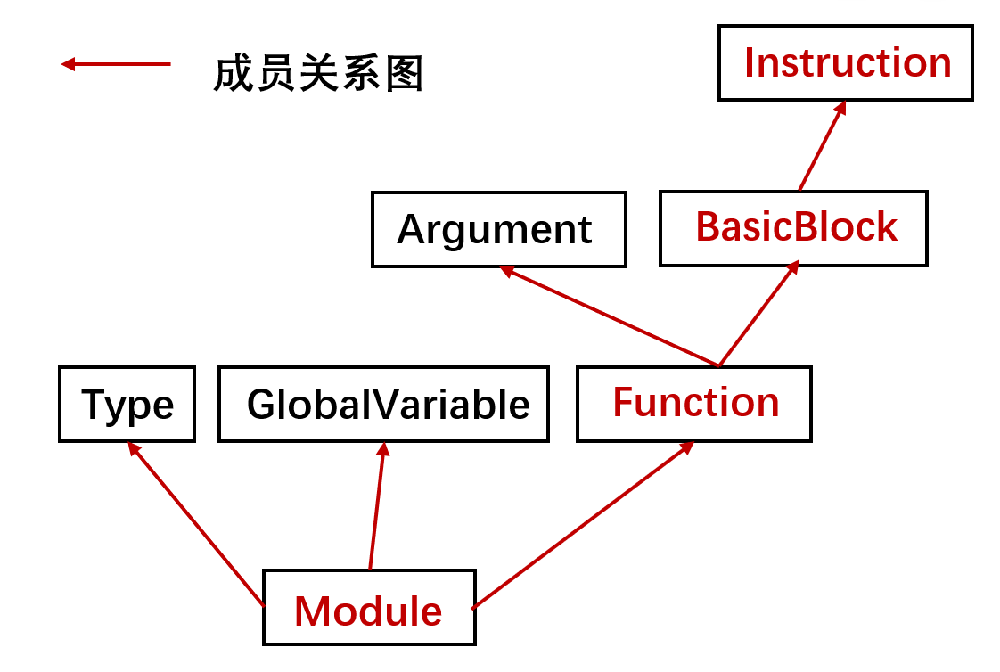
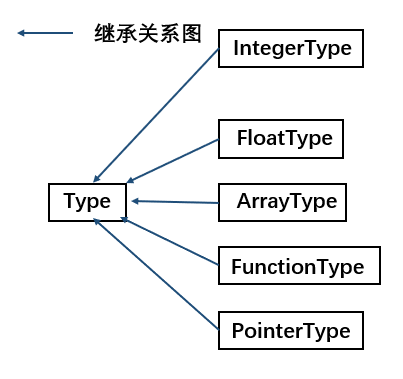

# Light IR

## Light IR 简介

本课程以 Cminusf 语言为源语言，从 LLVM IR 中裁剪出了适用于教学的精简的 IR 子集，并将其命名为 Light IR。同时依据 LLVM 的设计，为 Light IR 提供了配套简化的 [C++ 库](./LightIR.md#c-apis)，用于生成 IR。

<!-- TODO: 换简单例子 -->

如下是一段 C 语言代码 `easy.c` 与 其对应的 IR 文件 `easy.ll` 示例。

- `easy.c`:

  ```c
  int main(){
    int a;
    int b;
    a = 1;
    b = 2;
    return a + b;
  }
  ```

- `easy.ll`:

  ```c
  ; 整个 .ll 文件称为 module
  ; ModuleID = 'easy.c'
  ; ...
  ; module 中至少有一个 main function
  define dso_local i32 @main() #0 {
    ; 此处 main function 仅有 1 个 basicblock
    ; basicblock 由一系列 instruction 组成
    %1 = alloca i32, align 4
    %2 = alloca i32, align 4
    %3 = alloca i32, align 4
    store i32 0, i32* %1, align 4
    store i32 1, i32* %2, align 4
    store i32 2, i32* %3, align 4
    %4 = load i32, i32* %2, align 4
    %5 = load i32, i32* %3, align 4
    %6 = add nsw i32 %4, %5
    ret i32 %6
  }
  ; ...
  ```

## Light IR 指令

### Light IR 指令假设

Light IR 指令从 LLVM IR 中裁剪得到，因此保留了 LLVM IR 如下的指令规范

- 采用 3 地址的方式
  - `%2 = add i32 %0, %1`
- 无限寄存器 + 静态单赋值形式
  - IR 中的变量均代表了一个虚拟寄存器，并且数量无上限
  - 每个虚拟寄存器只被赋值一次
- 强类型系统

  - 每个操作数都具备自身的类型，分为基本类型，以及组合类型

    基本类型：

    - `i1`：1 位宽的整数类型
    - `i32`：32 位宽的整数类型
    - `float`：单精度浮点数类型
    - `label`: 基本块的标识符类型

    组合类型：

    - 指针类型：`<type> *`，例如 `i32*, [10 x i32*]`
    - 数组类型：`[n x <type>]`，例如 `[10 x i32], [10 x [10 x i32]]`
    - 函数类型：`<ret-type>@(<arg-type>)`，由函数返回值类型与参数类型列表组合成的类型

    组合类型可以嵌套，例如前面的 `[10 x [10 x i32]]` 就是嵌套后的类型。

### Light IR 指令详解

#### Terminator Instructions

**注**：`ret` 与 `br` 都是 Terminator Instructions 也就是终止指令，在 llvm 基本块的定义里，基本块是单进单出的，因此只能有一条终止指令（`ret` 或 `br`）。

##### Ret

- 概念：返回指令。用于将控制流（以及可选的值）从函数返回给调用者。`ret`指令有两种形式：一种返回值，然后终结函数，另一种仅终结函数。
- 格式
  - `ret <type> <value>`
  - `ret void`
- 例子：
  - `ret i32 %0`
  - `ret void`

##### Br

- 概念：跳转指令。用于使控制流转移到当前功能中的另一个基本块。该指令有两种形式，分别对应于条件分支和无条件分支。
- 格式：
  - `br i1 <cond>, label <iftrue>, label <iffalse>`
  - `br label <dest>`
- 例子：
  - `br i1 %cond, label %truebb, label %falsebb`
  - `br label %bb`

#### Standard Binary Instructions

##### Add FAdd

- 概念：`add`指令返回其两个`i32`类型的操作数之和，返回值为`i32`类型，`fadd`指令返回其两个`float`类型的操作数之和，返回值为`float`类型。
- 格式：
  - `<result> = add <type> <op1>, <op2>`
  - `<result> = fadd <type> <op1>, <op2>`
- 例子：
  - `%2 = add i32 %1, %0`
  - `%2 = fadd float %1, %0`

##### Sub FSub

- 概念：`sub`指令返回其两个`i32`类型的操作数之差，返回值为`i32`类型，`fsub`指令返回其两个`float`类型的操作数之差，返回值为`float`类型。
- 格式与例子与`add`，`fadd`类似

##### Mul FMul

- 概念：`mul`指令返回其两个`i32`类型的操作数之积，返回值为`i32`类型，`fmul`指令返回其两个`float`类型的操作数之积，返回值为`float`类型。
- 格式与例子与`add`，`fadd`类似

##### SDiv FDiv

- 概念：`sdiv`指令返回其两个`i32`类型的操作数之商，返回值为`i32`类型，`fdiv`指令返回其两个`float`类型的操作数之商，返回值为`float`类型。
- 格式与例子与`add`，`fadd`类似

#### Memory Instructions

##### Alloca

- 概念： `alloca`指令在当前执行函数的栈帧（Stack Frame）上分配内存。
- 格式：`<result> = alloca <type>`
- 例子：
  - `%ptr = alloca i32`
  - `%ptr = alloca [10 x i32]`

##### Load

- 概念：`load`指令用于从内存中读取。
- 格式：`<result> = load <type>, <type>* <pointer>`
- 例子：`%val = load i32, i32* %ptr`

##### Store

- 概念：`store`指令用于写入内存。
- 格式：`store <type> <value>, <type>* <pointer>`
- 例子：`store i32 3, i32* %ptr`

#### CastInst

##### ZExt

- 概念：`zext`指令将其操作数**零**扩展为`type2`类型。
- 格式：`<result> = zext <type> <value> to <type2>`
- 例子：`%1 = zext i1 %0 to i32`

##### FpToSi

- 概念：`fptosi`指令将浮点值转换为`type2`（整数）类型。
- 格式：`<result> = fptosi <type> <value> to <type2>`
- 例子：`%Y = fptosi float 1.0E-247 to i32`

##### SiToFp

- 概念：`sitofp`指令将有符号整数转换为`type2`（浮点数）类型。
- 格式：`<result> = sitofp <type> <value> to <type2>`
- 例子：`%X = sitofp i32 257 to float`

#### Other Instructions

##### ICmp FCmp

- 概念：`icmp`指令根据两个整数的比较返回布尔值，`fcmp`指令根据两个浮点数的比较返回布尔值。
- 格式：
  - `<result> = icmp <cond> <type> <op1>, <op2>`
    - `<cond> = eq | ne | sgt | sge | slt | sle`
  - `<result> = fcmp <cond> <type> <op1>, <op2>`
    - `<cond> = eq | ne | ugt | uge | ult | ule`
- 例子：`i1 %2 = icmp sge i32 %0, %1`

##### Call

- 概念：`call`指令用于使控制流转移到指定的函数，其传入参数绑定到指定的值。在被调用函数中执行`ret`指令后，如果被调用函数返回值不为 `void` 类型，控制流程将在函数调用后继续执行该指令，并且该函数的返回值绑定到`result`参数。
- 格式：
  - `<result> = call <return ty> <func name>(<function args>)`
  - `call <func name>(<function args>)`
- 例子：
  - `%0 = call i32 @func( i32 %1, i32* %0)`
  - `call @func( i32 %arg)`

##### GetElementPtr

- 概念：`getelementptr`指令用于获取数组结构的元素的地址。它**仅执行地址计算**，并且不访问内存。
- 格式
  - 数组：`<result> = getelementptr <type>, <type>* <ptrval>, i32 0, i32 <idx>`
  - 指针（仅在数组作为函数参数时存在）：`<result> = getelementptr <type>, <type>* <ptrval>, i32 <idx>`
- 参数解释：`getelementptr` 后面的两个 `<type>` 一定是相同的。`<ptrval>` 表示指针，`<idx>` 表示索引（也即数组下标）
- 例子：
  - `%2 = getelementptr [10 x i32], [10 x i32]* %1, i32 0, i32 %0`
  - `%2 = getelementptr i32, i32* %1 i32 %0`
- 额外阅读：[The Often Misunderstood GEP Instruction](https://llvm.org/docs/GetElementPtr.html)

## Light IR C++ 库

Light IR C++ 库依据 LLVM 设计，用于生成 IR。在介绍其核心类之前，先展示 Light IR 的结构

!!! warning

    在必做实验阶段，请不要对 Light IR C++ 库进行直接修改

### Light IR 结构

<!-- TODO: 重绘图片 -->


实验中需要生成的 IR 代码有着相对固定的结构模式：

- 最上层的是 module，对应一个 Cminusf 源文件。包含全局变量 global_variable 和函数 function。
- function 由头部和函数体组成。function 的头部包括返回值类型、函数名和参数表。函数体可以由一个或多个 basicblock 构成。
- basicblock 是指程序顺序执行的语句序列，只有一个入口和一个出口。basicblock 由若干指令 instruction 构成。
- 注意一个 basicblock 中的**只能有一条终止指令**（Ret/Br）。

!!! notes

    为了区别 Light IR 中的概念与我们实现的 Light IR C++ 库。我们用小写 plain text 来表示 Light IR 中的概念，例如 module；用大写的 code block 来表示 C++ 实现，例如 `Module`。

### Light IR C++ 类总览

在上一节中，可以看出 Light IR 最顶层的结构是 module，并具有层次化结构，在 Light IR C++ 库中，对应有层次化类的设计，如图所示，`Module`, `Function`, `BasicBlock`, `Instruction` 类分别对应了 Light IR 中 module，function，basicblock，instruction 的概念。


### Light IR C++ 数据基类：Value，User

#### Value

`Value` 类代表一个可用于指令操作数的带类型的数据，包含众多子类，`Instruction` 也是其子类之一，表示指令在创建后可以作为另一条指令的操作数。`Value` 成员 `use_list_` 是 `Use` 类的列表，每个 Use 类记录了该 `Value` 的一次被使用的情况

!!! note "use-list 详解"

    例如，如果存在指令 `%op2 = add i32 %op0, %op1`，那么 `%op0`、`%op1` 就被 `%op2` 所使用，`%op0` 基类 `Value` 的 `use_list_` 里就会有 `Use(%op2, 0)`（这里的 0 代表 `%op0` 是被使用时的第一个参数）。同理，`%op1` 的 `use_list_` 里有 `Use(%op2, 1)`。

<!-- TODO: 介绍 use-list -->


!!! note

    `Instruction` 类是 `Value` 的子类，这表示，指令在使用操作数创建后的返回值也可以作为另一条指令创建的操作数。

#### User

<!-- TODO: 修改表述 -->

`User` 作为 `Value` 的子类，含义是使用者，`Instruction` 也是其子类之一，`User` 类成员 `operands_` 是`Value` 类的列表，表示该使用者使用的操作数列表。如图是 `User` 类的子类继承关系。


!!! note

    `Value` 类的 use-list，与 User 类的 operand-list 构成了指令间的依赖关系图。

### Light IR C++ 类型基类：Type

在 [Light IR 指令假设](./LightIR.md#lightir-指令假设)中提到，Light IR 保留了 LLVM IR 的强类型系统，包含基本类型与组合类型，`Type` 类是所有类型基类，其子类继承关系如图所示，其中 `IntegerType`, `FloatType` 对应表示 Light IR 中的 `i1`，`i32`，`float` 基本类型。`ArrayType`，`PointerType`，`FunctionType` 对应表示组合类型：数组类型，指针类型，函数类型。


获取基本类型的接口在 `Module` 类中，获取组合类型的接口则在组合类型对应的类中：

```cpp
// 获取 i1 基本类型
auto int1_type = module->get_int1_type();
// 获取 [2 x i32] 数组类型
auto array_type = ArrayType::get(Int32Type, 2);
```

### 使用 Light IR C++ 库生成 IR

本小节将以下列 Light IR 片段介绍使用 Light IR C++ 接口层次化顺序生成 IR 的过程，

```c
define i32 @main() #0 {
entry：
  %1 = alloca i32
  store i32 72, i32* %1
  %2 = load i32, i32* %1
  ret i32 %2
}
```

#### 创建 `Module`, `Function`, `BasicBlock` 的接口

创建 module

```cpp
auto module = new Module();
```

为 module 添加 main function 定义

```cpp
auto mainFun = Function::create(..., "main", module);
```

为 main function 创建 function 内的第一个 basicblock

```cpp
auto bb = BasicBlock::create(module, "entry", mainFun);
```

接下来需要用辅助类 `IRBuilder` 向 basicblock 中插入指令

#### `IRBuilder`: 生成 IR 指令的辅助类

Light IR C++ 库为生成 IR 指令提供了辅助类：`IRBuilder`。该类提供了独立创建 IR 指令的接口，可以创建指令的同时并将它们插入 basicblock 中，`IRBuilder` 类提供以下接口：

```cpp
class IRBuilder {
public:
    // 返回当前插入的基本块
    BasicBlock *get_insert_block()
    // 设置当前插入的基本块
    void set_insert_point(BasicBlock *bb)
    // 创建一条除法指令，并加入当前基本块中
    BinaryInst *create_isdiv(Value *lhs, Value *rhs)
    // 创建的 instr_type 类型的指令，并插入到当前基本块中
    // 可根据 IRBuilder.h 查看每一条指令的创建细节
    Instruction *create_[instr_type](...);
};
```

在创建 module，main function，basicblock 后：

```cpp
auto module = new Module();
auto mainFun = Function::create(..., "main", module);
auto bb = BasicBlock::create(module, "entry", mainFun);
```

创建 `IRBuilder`，并使用 `IRBuilder` 创建新指令

```cpp
// 实例化 IRbuilder
auto builder = new IRBuilder(nullptr, module);

builder->set_insert_point(bb);
// 从 module 中获取 i32 类型
Type *Int32Type = Type::get_int32_type(module);
// 为变量 x 分配栈上空间
auto xAlloca = builder->create_alloca(Int32Type);
// 创建 store 指令，将 72 常数存到 x 分配空间里
builder->create_store(ConstantInt::get(72, module), xAlloca);
// 创建 load 指令，将 x 内存值取出来
xLoad = builder->create_load(xAlloca);
// 创建 ret 指令，将 x 取出的值返回
builder->create_ret(xLoad);
```

至此，使用 Light IR C++ 接口层次化顺序生成 IR 的过程流程结束

### Light IR C++ 库核心类定义

本节梳理了在生成 IR 过程中可能会用到的接口，学生可按需进行查阅

<!-- TODO：检查接口是否被框架整理所影响 -->

#### Module

- 概念：一个编译单元。对应一个 Cminusf 文件。

??? info "Module 常用接口"

    ```cpp
    class Module
    {
    public:
        // 将函数 f 添加到该模块的函数链表上
        // 在函数被创建的时候会自动调用此方法
        void add_function(Function *f);
        // 将全局变量 g 添加到该模块的全局变量链表上
        // 在全局变量被创建的时候会自动调用此方法
        void add_global_variable(GlobalVariable* g);
        // 获取全局变量列表
        std::list<GlobalVariable *> get_global_variable();
        // 获得（创建）自定义的 Pointer 类型
        PointerType *get_pointer_type(Type *contained);
        // 获得（创建）自定义的 Array 类型
        ArrayType *get_array_type(Type *contained, unsigned num_elements);
        // 获得基本类型 int32
        IntegerType *get_int32_type();
        // 其他基本类型类似...
    };
    ```

#### BasicBlock

- 概念：基本块。是一个是单入口单出口的代码块，可以作为分支指令目标对象。

??? info "BasicBlock 常用接口"

    ```cpp
    class BasicBlock : public Value {
    public:
        // 创建并返回基本块，参数分别是基本块所属的模块，基本块名字（默认为空），基本块所属的函数
        static BasicBlock *create(Module *m, const std::string &name, Function *parent);
        // 返回该基本块所属的函数
        Function *get_parent();
        // 返回该基本块所属的模块
        Module *get_module();
        // 返回该基本块的终止指令，若基本块的最后一条指令不是终止指令返回则返回 nullptr
        Instruction *get_terminator();
        // 将指令 instr 添加到该基本块的指令链表末端，使用 IRBuilder 来创建函数时会自动调用此方法
        void add_instruction(Instruction *instr);
        // 将指令 instr 添加到该基本块的指令链表首部
        void add_instr_begin(Instruction *instr);
        // 将指令 instr 从该基本块的指令链表中移除，该 API 会同时维护好 instr 的操作数的 use 链表。
        void erase_instr(Instruction *instr);
        // 判断该基本块是否为空
        bool empty();
        // 返回该基本块中的指令数目
        int get_num_of_instr();
        // 返回该基本块的指令链表
        std::list<Instruction *> &get_instructions();
        // 将该基本块从所属函数的基本块链表中移除
        void erase_from_parent();

        /****************APIs about cfg****************/
        // 返回前驱基本块集合
        std::list<BasicBlock *> &get_pre_basic_blocks();
        // 返回后继基本块集合
        std::list<BasicBlock *> &get_succ_basic_blocks();
        // 添加前驱基本块
        void add_pre_basic_block(BasicBlock *bb);
        // 添加后继基本块
        void add_succ_basic_block(BasicBlock *bb);
        // 移除前驱基本块
        void remove_pre_basic_block(BasicBlock *bb);
        // 移除后继基本块
        void remove_succ_basic_block(BasicBlock *bb);
        /****************APIs about cfg****************/
    };
    ```

#### GlobalVariable

- 概念：全局变量。

??? info "GlobalVariable 常用接口"

    ```cpp
    class GlobalVariable : public User {
    public:
        // 创建一个全局变量
        static GlobalVariable *create(std::string name, Module *m, Type* ty,
                                      bool is_const, Constant* init );
    };
    ```

#### Constant

- 概念：常量。不同类型的常量由不同类来表示。

??? info "Constant 常用接口"

    ```cpp
    class Constant : public User {
    public:
        Constant(Type *ty, const std::string &name = "", unsigned num_ops = 0);
    };
    ```

??? info "整型常量 ConstantInt 常用接口"

    ```cpp
    class ConstantInt : public Constant {
    public:
        // 返回该常量中存的数
        int get_value();
        // 返回常量 const_val 中存的数
        static int get_value(ConstantInt *const_val);
        // 以值 val 来创建常量
        static ConstantInt *get(int val, Module *m);
        // 以值 val 来创建 bool 常量
        static ConstantInt *get(bool val, Module *m);
    };
    ```

??? info "浮点数常量 ConstantFP 常用接口"

    ```cpp
    class ConstantFP : public Constant {
    public:
        // 以值 val 创建并返回浮点数常量
        static ConstantFP *get(float val, Module *m);
        // 返回该常量中存的值
        float get_value();
    };
    ```

??? info "ConstantZero 常用接口"

    ```cpp
    // 用于全局变量初始化的零常量
    class ConstantZero : public Constant {
    public:
        // 创建并返回零常量
        static ConstantZero *get(Type *ty, Module *m);
    };
    ```

#### Argument

- 概念：函数的参数。

??? info "Argument 常用接口"

    ```cpp
    class Argument : public Value
    {
    public:
        // 返回该参数的所属的函数
        Function *get_parent();
        // 返回该参数在所在函数的参数列表中的序数
        unsigned get_arg_no() const;
    };
    ```

#### Function

- 概念：函数。该类描述了一个过程，包含多个基本块。

??? info "Funtion 常用接口"

    ```cpp
    class Function : public Value {
    public:
        // 创建并返回函数，参数依次是待创建函数类型 ty，函数名字 name (不可为空)，函数所属的模块 parent
        static Function *create(FunctionType *ty, const std::string &name, Module *parent);
        // 返回该函数的函数类型
        FunctionType *get_function_type() const;
        // 返回该函数的返回值类型
        Type *get_return_type() const;
        // 将基本块 bb 添加至该函数末端（调用基本块的创建函数时会自动调用此函数来）
        void add_basic_block(BasicBlock *bb);
        // 得到该函数参数数量
        unsigned get_num_of_args() const;
        // 得到该函数基本块数量
        unsigned get_num_basic_blocks() const;
        // 得到该函数所属的 Module
        Module *get_parent() const;
        // 从函数的基本块链表中删除基本块 bb
        void remove(BasicBlock* bb)
        // 返回函数基本块链表
        std::list<BasicBlock *> &get_basic_blocks()
        // 返回函数的参数链表
        std::list<Argument *> &get_args()
        // 给函数中未命名的基本块和指令命名
        void set_instr_name();
    };
    ```

#### IRBuilder

- 概念：生成 IR 的辅助类。该类提供了独立的接口创建各种 IR 指令，并将它们插入基本块中（注意：该辅助类不做任何类型检查）。

??? info "IRBuilder 常用接口"

    ```cpp
    class IRBuilder {
    public:
        // 返回当前插入的基本块
        BasicBlock *get_insert_block()
        // 设置当前插入的基本块
        void set_insert_point(BasicBlock *bb)
        // 创建的指令并对应插入到基本块中，函数名字和参数名字和 IR 文档是一一对应的
        // 具体查看 IRBuilder.h
        Instruction *create_[instr_type]();
    };
    ```

#### Instruction

- 概念：指令。该类是所有 LLVM 指令的基类。子类包含 IR 部分中的所有指令。

??? info "Instruction 常用接口"

    ```c++
    class Instruction : public User {
    public:
        // 获取指令所在函数
        Function *get_function();
        // 获取指令所在 module
        Module *get_module();
        // 获取指令类型
        OpID get_instr_type() const { return op_id_; }
        // 获取指令类型的名字
        std::string get_instr_op_name() const;
        // 判断指令是否是 instr_type 类型
        bool is_[instr_type] const;
        // 判断指令是否是二元运算
        bool isBinary() const;
        // 判断指令是否为终止指令
        bool isTerminator() const;
    };
    ```

#### Type

- 概念：IR 的类型（包含 `VoidType`、`LabelType`、`FloatType`、`IntegerType`、`ArrayType`、`PointerType`）。module 中可以通过 API 获得基本类型，并创建自定义类型。
- 子类介绍：其中 `ArrayType`、`PointerType` 可以嵌套得到自定义类型，而 `VoidType`、`IntegerType`，`FloatType` 可看做 IR 的基本类型，`LabelType` 是 `BasicBlcok` 的类型，可作为跳转指令的参数，`FunctionType` 表示函数类型。其中 `VoidType` 与 `LabelType` 没有对应的子类，通过 `Type` 中的 `tid_` 字段判别，而其他类型均有对应子类

??? info "Type 常用接口"

    ```c++
    class Type {
    public:
        // 获取 type id
        TypeID get_type_id() const;
        // 判断是否是 ty 类型
        bool is_[ty]_type();
        // 若是 PointerType 则返回指向的类型，若不是则返回 nullptr。
        Type *get_pointer_element_type();
        // 若是 ArrayType 则返回数组元素的类型，若不是则返回 nullptr。
        Type *get_array_element_type();
        // 返回类型的大小
        unsigned get_size() const;
    };
    ```

??? info "数组类型 ArrayType 常用接口"

    ```c++
    class ArrayType : public Type {
    public:
        // 判断数组元素类型是否合法
        static bool is_valid_element_type(Type *ty);
        // 通过数组元素类型 contained 以及数组长度 num_elements 创建数组类型
        static ArrayType *get(Type *contained, unsigned num_elements);
        // 得到该数组类型的元素类型
        Type *get_element_type() const;
        // 获得该数组类型的长度
        unsigned get_num_of_elements();
    };
    ```

??? info "指针类型 PointerType 常用接口"

    ```c++
    class PointerType : public Type {
    public:
        // 获取该指针类型指向的元素类型
        Type *get_element_type() const;
        // 创建指向类型为 contained 的指针类型
        static PointerType *get(Type *contained);
    };
    ```

??? info "函数类型 FunctionType 常用接口"

    ```c++
    class FunctionType : public Type {
    public:
        // 判断返回值类型是否合法
        static bool is_valid_return_type(Type *ty);
        // 判断参数类型是否合法
        static bool is_valid_argument_type(Type *ty);
        // 根据返回值类型 result，参数类型列表 params 创建函数类型
        static FunctionType *get(Type *result, std::vector<Type*> params);
        // 返回该函数类型的参数个数
        unsigned get_num_of_args() const;
        // 获得该函数类型第 i 个参数的类型
        Type *get_param_type(unsigned i) const;
        // 获得该函数类型的参数类型链表的起始迭代器
        std::vector<Type *>::iterator param_begin();
        // 获得该函数类型的参数类型链表的结束迭代器
        std::vector<Type *>::iterator param_end();
        // 获得该函数类型的返回值类型
        Type *get_return_type() const;
    }
    ```

#### User

- 概念：使用者。维护了 use-def 信息，表示该使用者用了哪些值。

??? info "User 常用接口"

    ```cpp
    class User : public Value {
    public:
        // 从该使用者的操作数链表中取出第 i 个操作数
        Value *get_operand(unsigned i) const;
        // 将该使用者的第 i 个操作数设为值 v
        void set_operand(unsigned i, Value *v);
        // 将值 v 添加到该使用者的操作数链表上
        void add_operand(Value *v);
        // 得到操作数链表的大小
        unsigned get_num_operand() const;
        // 从该使用者的操作数链表中的所有操作数的使用情况中移除该使用者
        void remove_use_of_ops();
        // 从该使用者的操作数链表中移除第 index 个
        void remove_operands(unsigned index);
    };
    ```

#### Use

- 概念：代表了值的使用情况。

??? info "Use 常用接口"

    ```cpp
    struct Use {
        // 使用者
        Value *val_;
        // 使用者中值的序数
        // 对于 func(a, b)，a 为 0，b 为 1
        unsigned arg_no_;
    };
    ```

#### Value

- 概念：值。代表一个可能用于指令操作数的带类型数据，是最基础的类，维护了 def-use 信息，即该值被哪些使用者使用。

??? info "Value 常用接口"

    ```cpp
    class Value
    {
    public:
        // 获取该值的类型
        Type *get_type() const;

        // 取得该值的使用情况
        const std::list<Use> &get_use_list() const { return use_list_; }
        // 添加加该值的使用情况
        void add_use(Value *val, unsigned arg_no = 0);
        // 在所有地方将该值用新的值 new_val 替换，并维护好 use_def 和 def_use 链表
        void replace_all_use_with(Value *new_val);
        // 将值 val 从使用链表中移除
        void remove_use(Value *val);
    };
    ```
