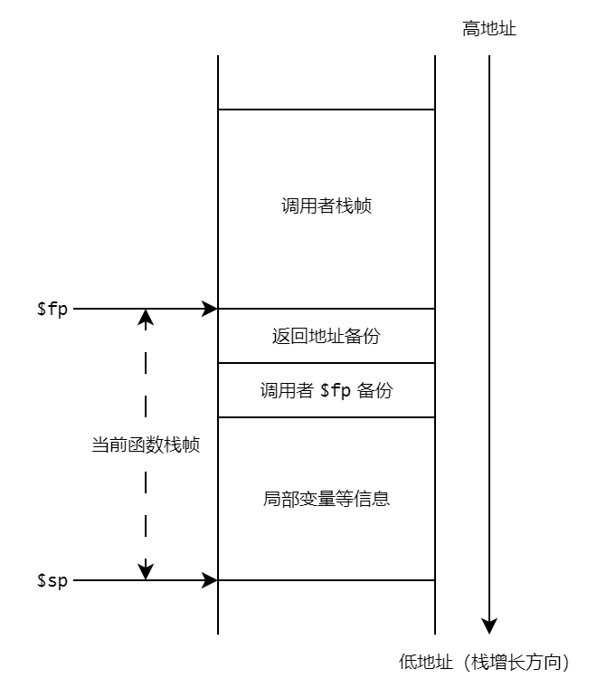

# 龙芯汇编介绍

<!-- TODO: 拆分文件 -->

<!-- TODO: 习题课 -->

<!-- TODO: 汇编填写挖空 -->

> 本介绍参考自[《龙芯架构参考手册 - 卷一：基础架构》](https://github.com/loongson/LoongArch-Documentation/releases/latest/download/LoongArch-Vol1-v1.02-CN.pdf)。

龙芯架构 LoongArch 是一种精简指令集计算机（RISC）风格的指令系统架构，分为 32 位和 64 位两个版本，分别称为 LA32 架构和 LA64 架构。我们主要关注 LA64 架构中的非向量整数指令和非向量浮点指令中的一部分，如果你想了解更多关于龙芯汇编的内容，可以参考[《龙芯架构参考手册 - 卷一：基础架构》](https://github.com/loongson/LoongArch-Documentation/releases/latest/download/LoongArch-Vol1-v1.02-CN.pdf)。

## 汇编文件的组成

以[示例 2](#示例-2) 中的汇编文件为例，下图展示了一个汇编文件的整体结构与组成：


其中

- 每一行 `#` 之后的是注释；
- 以 `.` 开头的语句是 [GNU 汇编伪指令](#gnu-汇编伪指令)，比如 `.text`、`.globl a` 和 `.space 4` 等等；
- 以 `:` 结尾的是标签，用于标记一条语句的位置，比如 `main`、`a` 和 `.main_label_entry` 等等；
- 形如 `$sp`、`$fp`、`$zero`、`$ra` 和 `$t0` 等以 `$` 开头的是[寄存器](#寄存器介绍)。

## 寄存器介绍

寄存器通过不同的首字母表明其属于哪个寄存器文件。对于非向量寄存器，以 `$rN` 标记通用寄存器，`$fN` 标记浮点寄存器。其中 `N` 是数字，表示操作的时该寄存器文件中的第 N 号寄存器。

### 通用寄存器

整数指令涉及的寄存器包括**通用寄存器** GR 和**程序计数器** PC。

其中通用寄存器有 32 个，记为 `$r0` ~ `$r31`，其中第 0 号寄存器 `$r0` 的值恒为 `0`。在 LA64 架构下，通用寄存器的位宽为 64 比特。

龙芯架构 ELF psABI 规范对通用寄存器遵循的使用作出了规定，其中，我们将用到以下寄存器：

|      名称       |     别名      |           用途           | 在调用中是否保留 |
| :-------------: | :-----------: | :----------------------: | :--------------: |
|      `$r0`      |    `$zero`    |         常数 `0`         |     （常数）     |
|      `$r1`      |     `$ra`     |         返回地址         |        否        |
|      `$r3`      |     `$sp`     |         堆栈指针         |        是        |
|  `$r4` - `$r5`  | `$a0` - `$a1` | 传参寄存器、返回值寄存器 |        否        |
| `$r6` - `$r11`  | `$a2` - `$a7` |        传参寄存器        |        否        |
| `$r12` - `$r20` | `$t0` - `$t8` |        临时寄存器        |        否        |
|     `$r22`      | `$fp` / `$s9` |  栈帧指针 / 静态寄存器   |        是        |

- 便于理解和记忆，寄存器一般都有一个别名。在汇编程序中可使用寄存器名、也可使用对应的别名来指代相应寄存器
- ”在调用中是否保留“这一栏表示在函数调用时，被调用函数是否需要在返回前将该寄存器的值恢复到调用前的状态

对于这些寄存器的用途，更详细的解释如下

- `$ra` (`$r1`)：用于存储函数的返回地址，在调用一个函数时（详见 [`bl`](#bl) 指令），函数的返回地址（即调用指令的下一条指令地址）会自动写入 `$ra` 中，用于在返回时恢复 `PC` 的值；

- `$sp` (`$r3`)、`$fp` (`$r22`)：分别存储当前函数的堆栈指针和栈帧指针，你可以在[栈帧布局](#栈帧布局)中了解到关于它们的更多信息

- `$a0` - `$a7` (`$r4` - `$r11`)：用于存储函数参数中的整数值

  比如在调用函数 `int func(int a, int b, int c[], float d)` 时，参数 `a`、 `b` 和 `c` 的值就分别存储在 `$a0`，`$a1` 和 `$a2` 中

- `$a0` (`$r4`) 和 `$a1` (`$r5`) 还用于存储返回值，即函数的整数返回值会存储在这两个寄存器中，被调用者获取

  比如在调用函数 `int const_ret() { return 0; }` 后，`$a0` 的值就是 `0`

- `$t0` - `$t8` (`$r12` - `$r20`)：用作临时寄存器，存储各个指令产生的中间值

### 浮点寄存器

浮点数指令涉及到的寄存器包括**浮点寄存器** FR、**条件标志寄存器** CFR 和**浮点控制状态寄存器** FCSR。我们将着重介绍前两种寄存器。

#### 浮点寄存器

浮点寄存器共有 32 个，记为 `$f0` ~ `$f31`，每一个都可以读写。

龙芯架构 ELF psABI 规范对浮点寄存器遵循使用作出了规定，其中，我们将用到以下浮点寄存器：

|      名称      |       别名       |           用途           | 在调用中是否保留 |
| :------------: | :--------------: | :----------------------: | :--------------: |
| `$f0` - `$f1`  | `$fa0` - `$fa1`  | 传参寄存器、返回值寄存器 |        否        |
| `$f2` - `$f7`  | `$fa2` - `$fa7`  |        传参寄存器        |        否        |
| `$f8` - `$f23` | `$ft0` - `$ft15` |        临时寄存器        |        否        |

这些寄存器的用途与对应的浮点寄存器类似，这里不再赘述。

#### 条件标志寄存器

条件标志寄存器共有 8 个，记为 `$fcc0` ~ `$fcc7`，每一个都可以读写，位宽为 1 比特。它们主要在以下两个场景中被用到：

- **浮点比较**的结果将写到条件标志寄存器中，比较结果为真时置 `1`，否则置 `0`
- **浮点分支指令的判断条件**来自条件标志寄存器

比如对于如下的 C 语言代码：

```c
int func_fcmp(float a, float b)
{
    if (a < b) {
        return 1;
    } else {
        return 0;
    }
}
```

可以手写 LA64 汇编如下（为了便于理解，这里的汇编代码与编译器生成的代码有所不同）：

```asm
# $fcc0 是条件标志寄存器, $fa0 和 $fa1 是浮点寄存器, $zero $t0 和 $a0 是通用寄存器
func_fcmp:
entry:
    # 这里省略保存各个保留寄存器 (即调用者信息) 的过程
    # 在调用函数时, $fa0 = a, $fa1 = b
    fcmp.slt.s $fcc0, $fa0, $fa1 # 浮点比较指令: $fcc0 = $fa0 < $fa1 ? 1 : 0
    bcnez      $fcc0, true_label # 浮点分支指令: 如果 $fcc0 != 0, 则跳转到 true_label
    b          false_label       # 无条件跳转指令, 跳转到 false_label
true_label:
    addi.w     $t0, $zero, 1     # $t0 = 0 + 1 = 1
    b          exit              # 无条件跳转指令, 跳转到 exit
false_label:
    addi.w     $t0, $zero, 0     # $t0 = 0 + 0 = 0
    b          exit              # 无条件跳转指令, 跳转到 exit
exit:
    ori        $a0, $t0, 0       # $a0 = $t0, $a0 是存储返回值的通用寄存器
    # 这里省略恢复各个保留寄存器 (即调用者信息) 的过程
    jr         $ra               # return
```

## 基础指令介绍

### 指令编码格式

在龙芯架构中，所有指令均采用 32 位固定长度，且指令的地址都要求 4 字节边界对齐。如下，为某个汇编程序进入函数体时，首条汇编指令及后 2 条指令的地址，可见指令的地址按照 4 字节边界对齐：

```
==> 0x120000660 <main+0>:        addi.d $r3,$r3,-32
    0x120000664 <main+4>:        st.d   $r22,$r3,24
    0x120000668 <main+8>:        addi.d $r22,$r3,32
```

### 汇编助记格式

龙芯架构对指令名的前、后缀进行了统一考虑，以方便汇编编程人员和编译器开发人员使用，例如 `fadd.s` 指令为“单精度” “浮点”加法指令。

#### 指令名前缀

龙芯架构指令前缀和指令类型的对应关系为：

| 指令前缀 |     指令类型     |
| :------: | :--------------: |
|  无前缀  |  非向量整数指令  |
|   `f`    | 非向量浮点数指令 |
|    ……    |        ……        |

#### 指令名后缀

其次，绝大多数指令通过指令名中 `.XX` 形式的后缀来指示指令的操作对象类型：

- 对于整数指令，后缀和操作对象类型的对应关系为

  | 指令后缀 | 操作对象类型 |  操作对象长度  |
  | :------: | :----------: | :------------: |
  |   `.b`   |     字节     | 1 字节 / 8 位  |
  |   `.h`   |     半字     | 2 字节 / 16 位 |
  |   `.w`   |      字      | 4 字节 / 32 位 |
  |   `.d`   |     双字     | 8 字节 / 64 位 |

- 对于浮点数指令，后缀和指令类型的对应关系为

  | 指令后缀 | 操作对象类型 |  操作对象长度  |
  | :------: | :----------: | :------------: |
  |   `.h`   | 半精度浮点数 | 2 字节 / 16 位 |
  |   `.s`   | 单精度浮点数 | 4 字节 / 32 位 |
  |   `.d`   | 双精度浮点数 | 8 字节 / 64 位 |
  |   `.w`   |      字      | 4 字节 / 32 位 |
  |   `.l`   |     双字     | 8 字节 / 64 位 |

当源操作数和目的操作数的数据位宽/类型一致时，指令名只有一个后缀。但是如果源操作数的数据位宽/类型情况一致，但和目的操作数不一致时，那么指令名将有两个后缀：

- 左边的后缀表示目的操作数的情况
- 右边的操作数表示源操作数的情况

比如，将长整数型定点数（双字）转化为单精度浮点数的指令名为 `ffint.s.l`（`.s` 表示转化的目标为单精度浮点数，`.l` 表示转化的源头为有双字）。

更复杂的数据位宽情况这里不做讨论，感兴趣的同学可以自行查阅[《龙芯架构参考手册 - 卷一：基础架构》](https://github.com/loongson/LoongArch-Documentation/releases/latest/download/LoongArch-Vol1-v1.02-CN.pdf)的 1.3 章节。

### 整数指令

在龙芯架构中，基础整数指令操作的数据类型有 5 种：

| 数据类型 |    英文    | 简记 | 长度 |
| :------: | :--------: | :--: | :--: |
|   比特   |    bit     |  b   |  1b  |
|   字节   |    Byte    |  B   |  8b  |
|   半字   |  Halfword  |  H   | 16b  |
|    字    |    Word    |  W   | 32b  |
|   双字   | Doubleword |  D   | 64b  |

字节、半字、字和双字数据类型均采用二进制补码的编码方式。

#### 算数/逻辑运算指令

##### add.w, add.d, sub.w, sub.d

- 指令格式：

  ```asm
  add.w $rd, $rj, $rk
  sub.w $rd, $rj, $rk
  add.d $rd, $rj, $rk
  sub.d $rd, $rj, $rk
  ```

- 行为：

  - `add.w`：将通用寄存器 `$rj` 中的 `[31:0]` 位数据加上通用寄存器 `$rk` 中的 `[31:0]` 位数据，所得结果的 `[31:0]` 位符号扩展后写入通用寄存器 `$rd` 中
  - `sub.w`：将通用寄存器 `$rj` 中的 `[31:0]` 位数据减去通用寄存器 `$rk` 中的 `[31:0]` 位数据，所得结果的 `[31:0]` 位符号扩展后写入通用寄存器 `$rd` 中
  - `add.d`：将通用寄存器 `$rj` 中的 `[63:0]` 位数据加上通用寄存器 `$rk` 中的 `[63:0]` 位数据，所得结果写入通用寄存器 `$rd` 中
  - `sub.d`：将通用寄存器 `$rj` 中的 `[63:0]` 位数据减去通用寄存器 `$rk` 中的 `[63:0]` 位数据，所得结果写入通用寄存器 `$rd` 中

- 注意事项：

  - 上述指令执行时不对溢出作特殊处理

- 示例：

  - 在执行下面的指令前，`$t0` 寄存器的值为 `0x0000_0000_0000_0003`，`$t1` 寄存器的值为 `0x0000_0000_0000_0005`

    ```asm
    sub.w $t2, $t0, $t1
    ```

    执行指令后，`$t2` 寄存器的值为 `0xffff_ffff_ffff_fffe`，即其 `[31:0]` 位数据等于 -2

##### mul.w, mul.d, div.w, div.d

- 指令格式：

  ```asm
  mul.w $rd, $rj, $rk
  div.w $rd, $rj, $rk
  mul.d $rd, $rj, $rk
  div.d $rd, $rj, $rk
  ```

- 行为：

  - `mul.w`：将通用寄存器 `$rj` 中的 `[31:0]` 位数据乘以通用寄存器 `$rk` 中的 `[31:0]` 位数据，所得乘积/商的 `[31:0]` 位数据符号扩展后写入通用寄存器 `$rd` 中
  - `div.w`：将通用寄存器 `$rj` 中的 `[31:0]` 位数据除去通用寄存器 `$rk` 中的 `[31:0]` 位数据，所得乘积/商的 `[31:0]` 位数据符号扩展后写入通用寄存器 `$rd` 中
  - `mul.d`：将通用寄存器 `$rj` 中的 `[63:0]` 位数据乘以通用寄存器 `$rk` 中的 `[63:0]` 位数据，所得乘积/商的 `[63:0]` 位数据写入通用寄存器 `$rd` 中
  - `div.d`：将通用寄存器 `$rj` 中的 `[63:0]` 位数据除去通用寄存器 `$rk` 中的 `[63:0]` 位数据，所得乘积/商的 `[63:0]` 位数据写入通用寄存器 `$rd` 中

- 注意事项：

  - 在 LA64 兼容的机器上，执行 `div.w` 指令时，如果通用寄存器 `$rj` 和 `$rk` 中的数值超过了 32 位有符号数的数值范围，则执行结果可以是无意义的任意值
  - `div.w` 进行除法操作时，操作数均视作有符号数
  - 对 `div.w` 指令，当除数是 0 时，结果可以是任意值

- 示例：

  - 在执行下面的指令前，`$t0` 寄存器的值为 `0x0000_0000_0000_0009`，`$t1` 寄存器的值为 `0x0000_0000_0000_0002`

    ```asm
    mul.w $t2, $t0, $t1
    div.w $t3, $t0, $t1
    ```

    执行指令后，`$t2` 寄存器的值为 `0x0000_0000_0000_0012`，`$t3` 寄存器的值为 `0x0000_0000_0000_0004`，即其 `[31:0]` 位数据分别等于 18 和 4

##### addi.w, addi.d

- 指令格式：

  ```asm
  addi.w $rd, $rj, si12
  addi.d $rd, $rj, si12
  ```

- 行为：

  - `addi.w`：将通用寄存器 `$rj` 中的 `[31:0]` 位数据加上 12 比特立即数 `si12` 符号扩展后的 32 位数据，所得结果的 `[31:0]` 位符号扩展后写入通用寄存器 `$rd` 中

  - `addi.d`：将通用寄存器 `$rj` 中的 `[63:0]` 位数据加上 12 比特立即数 `si12` 符号扩展后的 64 位数据，所得结果写入通用寄存器 `$rd` 中

- 注意事项：

  - 上述指令执行时不对溢出作特殊处理

- 示例：

  - 在执行下面的指令前，`$sp` 寄存器的值为 `0x0000_00ff_ffff_33f0`

    ```asm
    addi.d $fp, $sp, -32
    ```

    执行后，`$fp` 寄存器的值为 `0x0000_00ff_ffff_33d0`

##### lu12i.w, lu32i.d, lu52i.d

- 指令格式：

  ```asm
  lu12i.w $rd, si20
  lu32i.d $rd, si20
  lu52i.d $rd, $rj, si12
  ```

- 行为：

  - `lu12i.w`：将 20 比特立即数 `si20` 后的数据最低位连接上 12 比特 0（即 `si20` 逻辑左移 12 位），然后符号扩展后写入通用寄存器 `$rd` 中
  - `lu32i.d`：将 20 比特立即数 `si20` 符号扩展后的数据最低位连接上通用寄存器 `$rd` 中 `[31:0]` 位数据，结果写入到通用寄存器 `$rd` 中
  - `lu52i.d`：将 12 比特立即数 `si12`最低位连接上通用寄存器 `$rj` 中 `[51:0]` 位数据，结果写入到通用寄存器 `$rd` 中

- 注意事项：

  - 上述指令搭配 `ori` 指令，可以将超过 12 位的立即数装入通用寄存器中

- 示例：

  - 下面的指令将 `0x1234_5678_90ab_cdef` 装入了 `$t0` 寄存器

    ```asm
    lu12i.w $t0, -0x6f543    # $t0 = 0xffff_ffff_90ab_c000
    ori     $t0, $t0, 0xdef  # $t0 = 0xffff_ffff_90ab_cdef
    lu32i.d $t0, 0x45678     # $t0 = 0xfff4_5678_90ab_cdef
    lu52i.d $t0, $t0, 0x123  # $t0 = 0x1234_5678_90ab_cdef
    ```

  其中 `(int32_t)(-0x6f544)` = `(int32_t)(0xfff90abc)`

#### 整数比较指令

##### slt, sltu

- 指令格式：

  ```asm
  slt  $rd, $rj, $rk
  sltu $rd, $rj, $rk
  ```

- 行为：

  - `slt`：将通用寄存器 `$rj` 中的数据与通用寄存器 `$rk` 中的数据视**作有符号整数**进行大小比较，如果前者小于后者，则将通用寄存器 `$rd` 的值置为 `1`，否则置为 `0`

  - `sltu`：将通用寄存器 `$rj` 中的数据与通用寄存器 `$rk` 中的数据**视作无符号整数**进行大小比较，如果前者小于后者，则将通用寄存器 `$rd` 的值置为 `1`，否则置为 `0`

- 示例：

  - 在执行下面的指令前，`$t0` 寄存器的值为 `0x0000_0000_0000_0001`，`$t1` 寄存器的值为 `0x0000_0000_0000_0002`

    ```asm
    slt $t2, $t0, $t1
    ```

    执行指令后，`$t2` 寄存器的值为 `0x0000_0000_0000_0001`

##### slti, sltui

- 指令格式：

  ```asm
  slti  $rd, $rj, si12
  sltui $rd, $rj, si12
  ```

- 行为：

  - `slti`：将通用寄存器 `$rj` 中数据与 12 比特立即数 `si12` 符号扩展后所得的数据**视作有符号整数**进行大小比较，如果前者小于后者，则将通用寄存器 `$rd` 的值置为 `1`，否则置为 `0`

  - `sltui`：将通用寄存器 `$rj` 中数据与 12 比特立即数 `si12` 符号扩展后所得的数据**视作无符号整数**进行大小比较，如果前者小于后者，则将通用寄存器 `$rd` 的值置为 `1`，否则置为 `0`

- 示例：

  - 在执行下面的指令前，`$t0` 寄存器的值为 `0x0000_0000_0000_0008`

    ```asm
    slti $t1, $t0, 9
    ```

    执行指令后，`$t1` 寄存器的值为 `0x0000_0000_0000_0001`

#### 位运算指令

##### and, or, nor, xor

- 指令格式：

  ```asm
  and $rd, $rj, $rk
  or  $rd, $rj, $rk
  nor $rd, $rj, $rk
  xor $rd, $rj, $rk
  ```

- 行为：

  - `and`：将通用寄存器 `$rj` 中的数据与通用寄存器 `$rk` 中的数据进行按位逻辑与运算，结果写入通用寄存器 `$rd` 中
  - `or`：将通用寄存器 `$rj` 中的数据与通用寄存器 `$rk` 中的数据进行按位逻辑或运算，结果写入通用寄存器 `$rd` 中
  - `nor`：将通用寄存器 `$rj` 中的数据与通用寄存器 `$rk` 中的数据进行按位逻辑或非运算，结果写入通用寄存器 `$rd` 中
  - `xor`：将通用寄存器 `$rj` 中的数据与通用寄存器 `$rk` 中的数据进行按位逻辑异或运算，结果写入通用寄存器 `$rd` 中

##### andn, orn

- 指令格式：

  ```asm
  andn $rd, $rj, $rk
  orn  $rd, $rj, $rk
  ```

- 行为：

  - `andn`：将通用寄存器 `$rj` 中的数据与通用寄存器 `$rk` 中的数据**按位取反后**的数据进行按位逻辑与运算，结果写入通用寄存器 `$rd` 中
  - `orn`：将通用寄存器 `$rj` 中的数据与通用寄存器 `$rk` 中的数据**按位取反后**的数据进行按位逻辑或运算，结果写入通用寄存器 `$rd` 中

##### andi, ori, xori

- 指令格式：

  ```asm
  andi $rd, $rj, ui12
  ori  $rd, $rj, ui12
  xori $rd, $rj, ui12
  ```

- 行为：

  - `andi`：将通用寄存器 `$rj` 中数据与 12 比特立即数零扩展后的数据进行按位逻辑与运算，结果写入通用寄存器 `$rd` 中
  - `ori`：将通用寄存器 `$rj` 中数据与 12 比特立即数零扩展后的数据进行按位逻辑或运算，结果写入通用寄存器 `$rd` 中
  - `xori`：将通用寄存器 `$rj` 中数据与 12 比特立即数零扩展后的数据进行按位逻辑异或运算，结果写入通用寄存器 `$rd` 中

#### 位操作指令

##### bstrpick.w, bstrpick.d

- 指令格式：

  ```asm
  bstrpick.w $rd, $rj, msbw, lsbw
  bstrpick.d $rd, $rj, msbd, lsbd
  ```

- 行为：

  - `bstrpick.w`：提取通用寄存器 `$rj` 中 `[msbw:lsbw]` 位零扩展至 32 位，所形成 32 位中间结果符号扩展后写入通用寄存器 `$rd` 中

  - `bstrpick.d`：提取通用寄存器 `$rj` 中 `[msbd:lsbd]` 位零扩展至 64 位写入通用寄存器 `$rd` 中

- 示例：

  - 在执行下面的指令前，`$t0` 寄存器的值为 `0x0000_0000_0000_00FF`

    ```asm
    bstrpick.w $t1, $t0, 2, 0
    ```

    执行指令后，`$t1` 寄存器的值为 `0x0000_0000_0000_0007`

#### 分支指令

[示例 2](#示例-2) 给出了分支指令 `B` 的使用参考，[示例 3](#示例-3) 给出了过程调用中 `BL` 和 `JIRL` 的使用参考。

!!! info "跳转目标的表示"

    在汇编代码中，分支指令的跳转目标地址可以通过相应标签或使用字节为单位的偏移量表示。如果选择使用偏移量表示目标地址，那么在指令格式中的立即数字段应该填入以字节为单位的偏移值，即指令格式中的 `offs << 2`。

    比如，对于下面的汇编指令
    ```asm
    label_1:
        b label_2
    label_2:
        add $zero, $zero, $zero
    ```
    它等价于
    ```asm
    label_1:
        b 0x4
    label_2:
        add $zero, $zero, $zero
    ```

##### beq, bne, blt, bge, bltu, bgeu

- 指令格式：

  ```asm
  beq  $rj, $rd, offs16
  bne  $rj, $rd, offs16
  blt  $rj, $rd, offs16
  bge  $rj, $rd, offs16
  bltu $rj, $rd, offs16
  bgeu $rj, $rd, offs16
  ```

- 目标地址的计算方式：将指令码中的 16 比特立即数 `offs16` 逻辑左移 2 位后再符号扩展，所得偏移值加上该分支指令的 `PC`

- 行为：

  - `beq`：将通用寄存器 `$rj` 和通用寄存器 `$rd` 的值进行比较，如果两者相等则跳转到目标地址，否则不跳转

  - `bne`：将通用寄存器 `$rj` 和通用寄存器 `$rd` 的值进行比较，如果两者不等则跳转到目标地址，否则不跳转

  - `blt`：将通用寄存器 `$rj` 和通用寄存器 `$rd` 的值视作**有符号数**进行比较，如果前者小于后者则跳转到目标地址，否则不跳转

  - `bge`：将通用寄存器 `$rj` 和通用寄存器 `$rd` 的值视作**有符号数**进行比较，如果前者大于等于后者则跳转到目标地址，否则不跳转

  - `bltu`：将通用寄存器 `$rj` 和通用寄存器 `$rd` 的值视作**无符号数**进行比较，如果前者小于后者则跳转到目标地址，否则不跳转
  - `bgeu`：将通用寄存器 `$rj` 和通用寄存器 `$rd` 的值视作**无符号数**进行比较，如果前者大于等于后者则跳转到目标地址，否则不跳转

- 示例：

  - 在执行下面的指令前，`$t0` 寄存器的值为 `0x0000_0000_0000_0001`，`$t1` 寄存器的值为 `0x0000_0000_0000_0002`

    ```asm
        blt    $t0, $t1, true_label
        addi.w $t2, $zero, 0
        b      exit # 无条件跳转
    true_label:
        addi.w $t2, $zero, 1
        b      exit # 无条件跳转
    exit:
        # ...
    ```

    执行后，`$t2` 寄存器的值为 `0x0000_0000_0000_0001`

##### beqz, bnez

- 指令格式：

  ```asm
  beqz $rj, offs21
  bnez $rj, offs21
  ```

- 目标地址计算方式：将指令码中的 21 比特立即数 `offs21` 逻辑左移 2 位后再符号扩展，所得偏移值加上该分支指令的 `PC`

- 行为：

  - `beqz`：对通用寄存器 `$rj` 的值进行判断，如果等于 0 则跳转到目标地址，否则不跳转
  - `bnez`：对通用寄存器 `$rj` 的值进行判断，如果不等于 0 则跳转到目标地址，否则不跳转

- 示例：

  - 在执行下面的指令前，`$t0` 寄存器的值为 `0x0000_0000_0000_0001`

    ```asm
        bnez $t0, true_label
        addi $t2, $zero, 0
        b    exit # 无条件跳转
    true_label:
        addi $t2, $zero, 1
        b    exit # 无条件跳转
    exit:
        # ...
    ```

    执行后，`$t2` 寄存器的值为 `0x0000_0000_0000_0001`

##### b

- 指令格式：`b offs26`

- 目标地址计算方式：将指令码中的 26 比特立即数 `offs26` 逻辑左移 2 位后再符号扩展，所得偏移值加上该分支指令的 `PC`

- 行为：无条件跳转到目标地址处

##### bl

- 指令格式：`bl offs26`
- 目标地址计算方式：将指令码中的 26 比特立即数 `offs26` 逻辑左移 2 位后再符号扩展，所得偏移值加上该分支指令的 `PC`
- 行为：无条件跳转到目标地址处，同时将该指令的 `PC` 值加 4 的结果写入到 1 号通用寄存器 `$r1`（`$ra`）中
- 注意事项：
  - 1 号通用寄存器 `$r1` 作为返回地址寄存器 `$ra`
  - 该指令通常配合 `jirl` 指令，完成函数调用

##### jirl

- 指令格式：`jirl $rd, $rj, offs16`
- 目标地址计算方式：将指令码中的 16 比特立即数 `offs16` 逻辑左移 2 位后再符号扩展，所得偏移值加上通用寄存器 `$rj` 中的值
- 行为：无条件跳转到目标地址处，同时将该指令的 `PC` 值加 4 的结果写入到通用寄存器 `$rd` 中。

- 注意事项：
  - 宏指令 `jr $rj` 等价于 `jirl $zero, $rj, 0`
  - 当 `$rd` 为 `$r0` (`$zero`) 时，`jirl` 的功能即是一条普通的非调用间接跳转指令。
  - `$rd` 为 `$r0` (`$zero`)，`$rj` 为 `$r1` (`$ra`) 且 `offs16` 等于 0 的 `jirl`（即 `jr $ra`）常作为调用返回间接跳转使用

#### 普通访存指令

!!! info "小端序"

    龙芯架构只采用小端序（little endian）的储存方式，即一个字 `0x0123_4567` 在内存中的存储形式如下：

    | 地址 | 字节 |
    |:----:|:----:|
    | `base + 3` | `0x01` |
    | `base + 2` | `0x23` |
    | `base + 1` | `0x45` |
    | `base` | `0x67` |

为了简化实验，可以假设运算环境支持并允许非对齐访存，即 `ld` 和 `st` 指令不需要考虑地址对齐的问题。

##### ld.b, ld.h, ld.w, ld.d

后缀 `.b`、`.h`、`.w` 和 `.d` 分别代表字节/半字/字/双字数据类型，长度分别为 1 / 2 / 4 / 8 字节。

- `ld.b` / `ld.h` / `ld.w`

- 指令格式：

  ```asm
  ld.b $rd, $rj, si12
  ld.h $rd, $rj, si12
  ld.w $rd, $rj, si12
  ld.d $rd, $rj, si12
  ```

- 访存地址：通用寄存器 `$rj` 中的值与符号扩展后的 12 比特立即数 `si12` 相加求和的结果

- 行为：

  - `ld.b`：从内存取回一个字节的数据符号扩展后写入通用寄存器 `$rd`
  - `ld.h`：从内存取回一个半字的数据符号扩展后写入通用寄存器 `$rd`
  - `ld.w`：从内存取回一个字的数据符号扩展后写入通用寄存器 `$rd`
  - `ld.d`：从内存取回一个双字的数据写入通用寄存器 `$rd`

##### st.b, st.h, st.w, st.d

后缀 `.b`、`.h`、`.w` 和 `.d` 分别代表字节/半字/字/双字数据类型，长度分别为 1 / 2 / 4 / 8 字节。

- 指令格式：

  ```asm
  st.b $rd, $rj, si12
  st.h $rd, $rj, si12
  st.w $rd, $rj, si12
  st.d $rd, $rj, si12
  ```

- 访存地址：通用寄存器 `$rj` 中的值与零扩展后的 12 比特立即数 `si12` 相加求和的结果

- 行为：

  - `st.b`：将通用寄存器 `$rd` 中的 `[7:0]` 位数据写入到内存中
  - `st.h`：将通用寄存器 `$rd` 中的 `[15:0]` 位数据写入到内存中
  - `st.w`：将通用寄存器 `$rd` 中的 `[31:0]` 位数据写入到内存中
  - `st.d`：将通用寄存器 `$rd` 中的 `[63:0]` 位数据写入到内存中

#### 宏指令

##### jr

- 指令格式：`jr $rj`
- 行为：等价于 `jirl $zero, $rj, 0`
- 注意事项：
  - `jr $ra` 常作为调用返回间接跳转使用

##### la.local

- 指令格式：`la.local $rd, label`

- 行为：将定义在模块内的符号/标签（比如全局变量）的地址加载到通用寄存器 rd 中

- 示例：

  ```asm
  a: # 假设 a 的地址为 0x10000000
      .space 4
  # ...
  la.local $t0, a # 将 a 对应的地址加载到 $t0 中，即 $t0 = 0x10000000
  ```

### 浮点数指令

在龙芯架构中，浮点数据类型包括单精度浮点数和双精度浮点数，二者均遵循 IEEE 754-2008 标准规范中的定义。部分浮点指令（如浮点转换指令）也会涉及定点（整数）数据，包括字（Word，简记 W，长度 32b）和长字（Longword，简记 L，长度 64b），它们均采用二进制补码的编码方式。

#### 浮点运算指令

##### fadd.s, fsub.s, fmul.s, fdiv.s

- 指令格式：

  ```asm
  fadd.s $fd, $fj, $fk
  fsub.s $fd, $fj, $fk
  fmul.s $fd, $fj, $fk
  fdiv.s $fd, $fj, $fk
  ```

- 行为：

  - `fadd.s`：将浮点寄存器 `$fj` 中的单精度浮点数加上浮点寄存器 `$fk` 中的单精度浮点数，得到的单精度浮点数结果写入到浮点寄存器 `$fd` 中
  - `fsub.s`：将浮点寄存器 `$fj` 中的单精度浮点数减去浮点寄存器 `$fk` 中的单精度浮点数，得到的单精度浮点数结果写入到浮点寄存器 `$fd` 中
  - `fmul.s`：将浮点寄存器 `$fj` 中的单精度浮点数乘以浮点寄存器 `$fk` 中的单精度浮点数，得到的单精度浮点数结果写入到浮点寄存器 `$fd` 中
  - `fmul.d`：将浮点寄存器 `$fj` 中的单精度浮点数除以浮点寄存器 `$fk` 中的单精度浮点数，得到的单精度浮点数结果写入到浮点寄存器 `$fd` 中

- 注意事项：

  - 当操作数是单精度浮点数时，结果浮点寄存器的高 32 位可以是任意值

- 示例：

  - 在执行下面的指令前，`$ft0` 寄存器的值为 `0x0000_0000_4060_0000`（`3.5` 的 FP32 表示），`$ft1` 寄存器的值为 `0x0000_0000_4090_0000`（`4.5` 的 FP32 表示）`

    ```asm
    fadd.s $ft2, $ft0, $ft1
    fsub.s $ft3, $ft0, $ft1
    ```

    执行后，`$ft2` 寄存器的值为 `0x0000_0000_4100_0000`（`8.0` 的 FP32 表示），`$ft3` 寄存器的值为 `0x0000_0000_3f80_0000`（`4.5` 的 FP32 表示）`

#### 浮点转换指令

##### ffint.s.w

`ffint` 指令有两个后缀，其中第一个后缀 `.s` 表示转换的目标为单精度浮点数，第二个后缀 `.w` 表示转换的来源是整数型（字，4 字节）定点数。

- 指令格式：

  ```asm
  ffint.s.w $fd, $fj
  ```

- 行为：选择**浮点寄存器** `$fj` 中的整数型定点数转换为单精度浮点数，得到的单精度浮点数写入到浮点寄存器 `$fd` 中

- 示例：

  在执行下面的指令前，`$ft0` 寄存器的值为 `0x0000_0000_0000_0008`

  ```asm
  ffint.s.w $ft1, $ft0
  ```

  执行后，`$ft1` 寄存器的值为 `0x0000_0000_4100_0000`（`8.0` 的 FP32 表示）

##### ftintrz.w.s

??? info "舍入模式"

    为了和 LLVM IR/Light IR 中 `fptosi` 的行为一致，我们选择 “向零方向舍入”（rounding towards zero）作为舍入模式，即选择 `ftintrz` 作为转换浮点数为定点数的指令。
    龙芯架构中也有支持其他的舍入模式的 `ftint*` 指令，感兴趣的同学可以参考[《龙芯架构参考手册 - 卷一：基础架构》](https://github.com/loongson/LoongArch-Documentation/releases/latest/download/LoongArch-Vol1-v1.02-CN.pdf)的第 3.2.3.2 节。

`ftintrz` 指令有两个后缀，其中第一个后缀 `.w` 表示转换的目标是整数型（字，4 字节）定点数，第二个后缀 `.s` 表示转换的来源为单精度浮点数。

- 指令格式：

  ```asm
  ftintrz.w.s $fd, $fj
  ```

- 行为：选择浮点寄存器 `$fj` 中的单精度浮点数转换为整数型定点数，得到的整数型定点数写入到**浮点寄存器** `$fd` 中

- 示例：

  - 在执行下面的指令前，`$ft0` 寄存器的值为 `0x0000_0000_4108_0000`（`8.5` 的 FP32 表示）

    ```asm
    ftintrz.w.s $ft1, $ft0
    ```

    执行后，`$ft1` 寄存器的值为 `0x0000_0000_0000_0008`

#### 浮点搬运指令

##### movgr2fr.w

- 指令格式：

  ```asm
  movgr2fr.w $fd, $rj
  ```

- 行为：将通用寄存器 `$rj` 中的 `[31:0]` 位数据写入浮点寄存器 `$fd` 中的 `[31:0]` 位中

- 注意事项：

  - 使用 `movgr2fr.w` 指令后，浮点寄存器 `$fd` 的 `[63:32]` 位值不确定

- 示例：

  - 下面的指令将 `0x4108_0000` 装入 `$ft0` 寄存器的 `[31:0]` 位

    ```asm
    lu12i.w    $t0, 0x41080
    movgr2fr.w $ft0, $t0
    ```

##### movfr2gr.s

- `movfr2gr.s`

- 指令格式：

  ```asm
  movfr2gr.s $rd, $fj
  ```

- 行为：将浮点寄存器中的 `[31:0]` 位数据符号扩展后写入通用寄存器 `$rd`

- 示例：

  - 下面的指令将全局浮点数变量 `a` 转换为整型载入 `$t0` 中

    ```asm
    # 这里省略了一系列伪指令
    a:
        .space 4 # 申请 4 字节空间存储 a 的值
    # ...
    	la.local    $t1, a       # 将 a 的地址载入 $t1
    	fld.s       $ft0, $t1, 0 # 将 a 的值载入 $ft0
    	ftintrz.w.s $ft1, $ft0   # $ft1 = (int)a
    	movfr2gr.s  $t0, $ft1    # 将 $ft1 的数据载入 $t0 中
    ```

#### 浮点普通访存指令

##### fld.s, fld.d

- 指令格式：`fld.s $fd, $rj, si12`

  ```asm
  fld.s $fd, $rj, si12
  fld.d $fd, $rj, si12
  ```

- 访存地址：通用寄存器 `$rj` 中的值与符号扩展后的 12 比特立即数 `si12` 相加求和的结果

- 行为：

  - `fld.s`：从内存取回一个字的数据写入浮点寄存器 `$fd` 的 `[31:0]` 位
  - `fld.d`：从内存取回一个双字的数据写入浮点寄存器 `$fd`

- 注意事项：

  - 使用 `fld.s` 指令后，浮点寄存器 `$fd` 的 `[63:32]` 位值不确定

##### fst.s, fst.d

- 指令格式：

  ```asm
  fst.s $fd, $rj, si12
  fst.d $fd, $rj, si12
  ```

- 访存地址：通用寄存器 `$rj` 中的值与符号扩展后的 12 比特立即数 `si12` 相加求和的结果

- 行为：

  - `fst.s`：将浮点寄存器 `$fd` 中的 `[31:0]` 位数据写入到内存中
  - `fst.d`：将浮点寄存器 `$fd` 中的数据写入到内存中

#### 浮点比较指令

##### fcmp.cond.s, fcmp.cond.d

- 指令格式：

  ```asm
  fcmp.cond.s $fccd, $fj, $fk
  fcmp.cond.d $fccd, $fj, $fk
  ```

- 行为：根据 `cond` 对 `$fj` 和 `$fk` 进行比较，将比较的结果存入[条件标志寄存器](#条件标志寄存器) `$fccd`

- `cond`：下面是一部分实验中可能会使用到的 `cond` 的信息，

  | 助记符 | `cond` |   含义   |         为真的条件         |
  | :----: | :----: | :------: | :------------------------: |
  | `seq`  | `0x5`  |   相等   |        `$fj == $fk`        |
  | `sne`  | `0x11` |   不等   | `$fj > $fk` 或 `$fj < $fk` |
  | `slt`  | `0x3`  |   小于   |        `$fj < $fk`         |
  | `sle`  | `0x7`  | 小于等于 |        `$fj <= $fk`        |

  如果你想了解全部的 22 种 `cond`，可以参考[《龙芯架构参考手册 - 卷一：基础架构》](https://github.com/loongson/LoongArch-Documentation/releases/latest/download/LoongArch-Vol1-v1.02-CN.pdf)的第 3.2.2 节

- 示例：

  - 在执行下面的指令前，`$ft0` 寄存器的值为 `0x0000_0000_4060_0000`（`3.5` 的 FP32 表示），`$ft1` 寄存器的值为 `0x0000_0000_4090_0000`（`4.5` 的 FP32 表示）`

    ```asm
    fcmp.slt.s $fcc0, $ft0, $ft1
    ```

    执行后，条件标志寄存器 `$fcc0` 的值为 1

#### 浮点分支指令

!!! info "跳转目标的表示"

    在汇编代码中，分支指令的跳转目标地址可以通过相应标签或使用字节为单位的偏移量表示。如果选择使用偏移量表示目标地址，那么在指令格式中的立即数字段应该填入以字节为单位的偏移值，即指令格式中的 `offs << 2`。

    比如，对于下面的汇编指令
    ```asm
    label_1:
        bceqz $fcc0, label_2
    label_2:
        add $zero, $zero, $zero
    ```
    它等价于
    ```asm
    label_1:
        bceqz $fcc0, 0x4
    label_2:
        add $zero, $zero, $zero
    ```

##### bceqz, bcnez

- 指令格式：

  ```asm
  bceqz $fccj, offs21
  bcnez $fccj, offs21
  ```

- 跳转地址：将指令码中的 21 比特立即数 `offs21` 逻辑左移 2 位后再符号扩展，所得偏移值加上该分支指令的 `PC` 的和

- 行为：

  - `bceqz`：对[条件标志寄存器](#条件标志寄存器) `$fccj` 的值进行判断，如果等于 0 则跳转到目标地址，否则不跳转
  - `bcnez`：对[条件标志寄存器](#条件标志寄存器) `$fccj` 的值进行判断，如果不等于 0 则跳转到目标地址，否则不跳转

- 示例：

  - 在执行下面的指令前，条件标志寄存器 `$fcc0` 的值为 1

    ```asm
        bcnez $fcc0, true_label
        b     false_label # 无条件跳转
    true_label:
        addi.w $t0, $zero, 1
        b      exit # 无条件跳转
    false_label:
        addi.w $t0, $zero, 0
        b      exit # 无条件跳转
    exit:
        # ...
    ```

    执行后，`$t0` 寄存器的值为 `0x0000_0000_0000_0001`

### GNU 汇编伪指令

由于生成的汇编代码最终会被 GNU 工具链中的 Assembler 翻译为机器语言，所以汇编代码中会包含一些 **GNU 汇编伪指令**。这里将简要介绍可能会用到的伪指令，如果想要更进一步了解 GNU 汇编伪指令，可以参考 [Assembler Directives](https://sourceware.org/binutils/docs-2.37/as/Pseudo-Ops.html#Pseudo-Ops)。

|                伪指令                |                                                  简介                                                  |
| :----------------------------------: | :----------------------------------------------------------------------------------------------------: |
|               `.text`                |                              告诉汇编器将下面的语句汇编到目标程序的代码段                              |
| `.globl <symbol>`/`.global <symbol>` |     声明一个符号（通常是标签） `symbol` 为全局符号<br />这意味着该符号可被其他源文件或目标文件访问     |
|    `.type <symbol>, <type_desc>`     | 将符号指定为特定的类型，我们将主要用到两种类型：<br />`@function`（函数）和 `@object`（数据对象/变量） |
|            `.section ...`            |                         指定汇编代码或数据应该放在哪个段中，并可以控制段的属性                         |
|       `.size <symbol>, <expr>`       |                                告诉汇编器 `symbol` 的大小为 `expr` 字节                                |
|           `.space <size>`            |                                         分配 `size` 字节的空间                                         |

其中，对于 `.section` 伪指令，我们只在给全局变量分配空间时会用到它，具体的语句为：

```asm
.section .bss, "aw", @nobits
```

这三个参数的含义分别是：

- `.bss`：将数据放在 BSS 段中
- `"aw"`：指定这段空间为可分配（allocatable）且可写（writable）的
- `@nobits`：这段空间不占用实际的文件空间，而是在加载可执行文件时被分配

#### 示例

下面是一段简单的 C 代码：

```c
int globalInt;
float globalFloat;
int globalIntArray[10];

int main(void) {
    return 0;
}
```

编译器生成的汇编代码如下，其中有大量的伪指令，注释中有对各条伪指令的说明：

```asm
# Global variables
	.text                         # 后面的内容将放在代码段 (但是由于 .section, 全局变量实际被放到了 BSS 段)
	.section .bss, "aw", @nobits  # 将后面的全局变量放到 BSS 段, 并设置属性

	.globl globalInt              # 标记 globalInt 为全局符号
	.type globalInt, @object      # 标记 globalInt 为数据对象/变量
	.size globalInt, 4            # 标记 globalInt 的大小为 4 字节
globalInt:
	.space 4                      # 为 globalInt 分配 4 字节空间

	.globl globalFloat            # 标记 globalFloat 为全局符号
	.type globalFloat, @object    # 标记 globalFloat 为数据对象/变量
	.size globalFloat, 4          # 标记 globalFloat 的大小为 4 字节
globalFloat:
	.space 4                      # 为 globalFloat 分配 4 字节空间

	.globl globalIntArray         # 标记 globalIntArray 为全局符号
	.type globalIntArray, @object # 标记 globalIntArray 为数据对象/变量
	.size globalIntArray, 40      # 标记 globalIntArray 的大小为 40 字节 (4 * 10)
globalIntArray:
	.space 40                     # 为 globalIntArray 分配 40 字节空间

# Functions
	.text                 # 后面的内容将放在代码段
	.globl main           # 标记 main 为全局符号, main 函数是程序的入口, 因此这个标记是必须的
	.type main, @function # 标记 main 为函数
main:
	st.d $ra, $sp, -8
	st.d $fp, $sp, -16
	addi.d $fp, $sp, 0
	addi.d $sp, $sp, -16
.main_label_entry:
# ret i32 0
	addi.w $a0, $zero, 0
	b main_exit
main_exit:
	addi.d $sp, $sp, 16
	ld.d $ra, $sp, -8
	ld.d $fp, $sp, -16
	jr $ra
```

## 栈帧与函数调用

### 栈帧布局

栈帧是程序执行中的一个重要概念，主要用于支持函数调用和返回。因为函数的调用常常是嵌套的，所以堆栈中可能有多个函数的上下文信息。每个未完成运行的函数占用堆栈中一段独立的连续区域，这段区域即为栈帧（Stack Frame）。在调用函数时，栈帧被压入堆栈；在函数返回时，栈帧从堆栈中弹出。

龙芯架构 ELF psABI 规范中使用两个寄存器来访问堆栈：

- 栈帧指针 `$fp` 指向栈帧的底部
- 堆栈指针 `$sp` 指向栈帧的顶部

这两个寄存器的值应该对齐到 16 字节。维护好这两个寄存器的值后，就可以比较方便地访问栈帧中的函数上下文信息，比如返回地址和局部变量。下面是调用堆栈的一个示意图：



### 函数调用过程

函数调用的过程由调用者和被调用函数共同完成：

1. 调用方调用函数

   调用方将参数加载到适当的寄存器和堆栈位置，然后执行跳转指令：

   ```asm
   bl function # 执行跳转，并将 PC + 4 写入 $ra
   ```

2. 被调用方进入

   被调用方需要初始其堆栈并保存上下文信息，假设堆栈大小为 `N`，则对应的指令为：

   ```asm
   function:
       st.d   $ra, $sp, -8  # 保存返回地址
       st.d   $fp, $sp, -16 # 保存栈帧指针的值
       addi.d $fp, $sp, 0   # 将新的栈底值写入 $fp
       addi.d $sp, $sp, -N  # 分配栈帧
   .function_label_entry:
       ...
   ```

3. 被调用方退出

   在被调用方执行完指令后，被调用方将执行退出。被调用方将返回值放入对应寄存器，释放栈帧并恢复各个保留寄存器，最后返回调用方

   ```asm
   .function_label_exit:
       ori    $a0, $t0, 0   # 将返回结果保存至 $ra
       b      function_exit
   function_exit:
       addi.d $sp, $sp, N   # 恢复 $sp
       ld.d   $ra, $sp, -8  # 恢复 $ra
       ld.d   $fp, $sp, -16 # 恢复 $fp
       jr     $ra           # 返回到调用方
   ```

4. 调用方还原

   如果调用方在调用时分配了堆栈空间，则它需要将这些空间释放

### 参数传递

为了简化实验，编译器将遵循下面的参数传递规则：

- 与龙芯架构 ELF psABI 规范一致，编译器将使用 8 个通用寄存器 `$a0` - `$a7` (`$r4` - `$r11`) 和 8 个浮点寄存器 `$fa0` - `$fa1` (`$f0` - `$f7`) 用于参数传递，其中

  - 整数类型（指针或者整型）的参数用通用寄存器`$a0` - `$a7` (`$r4` - `$r11`) 传递
  - 浮点数类型的参数使用浮点寄存器 `$fa0` - `$fa1` (`$f0` - `$f7`) 传递
  - 按照顺序，参数依次放入对应的寄存器中

- 示例：下面的函数在注释中提供了各个参数对应的寄存器分配情况

  ```c
  int function(
      int a,    // 整型，放入 $a0
      int b[],  // 指针，放入 $a1
      float c,  // 浮点数，放入 $fa0
      int d,    // 整型，放入 $a2
      float e,  // 浮点数，放入 $fa1
      float f   // 浮点数，放入 $fa2
  )
  ```

这个规则只使用通用/浮点参数寄存器来传递参数，不会将参数传递到栈上。具体而言，编译器假定函数的整数类型参数和浮点类型参数均不超过 8 个，对于参数个数超过 8 个的情况，暂不做考虑。

你可以在这个规则上进行拓展，以支持更多参数的情况。

### 函数的返回

- 如果返回值类型时整数类型（指针或者整型），则返回值放入 `$a0` 中
- 如果返回值类型时浮点数类型，则返回值放入 `$fa0` 中

## LA64 汇编示例

下面的汇编代码可能与实验需要实现的编译器的生成结果有所差异。

### 示例 1

源程序：

```c
int main(void) {
    return 0;
}
```

汇编代码：

```asm
    .text                 # 标记代码段
    .globl main           # 标记 main 为全局符号
    .type main, @function # 标记 main 为函数
main:
    st.d $ra, $sp, -8     # 保存返回地址
    st.d $fp, $sp, -16    # 保存调用者的栈帧指针
    addi.d $fp, $sp, 0    # 设置新的栈帧指针
    addi.d $sp, $sp, -16  # 入栈, 为栈帧分配 16 字节的空间

    addi.w $a0, $zero, 0  # 将返回值设置成 1

    addi.d $sp, $sp, 16   # 出栈, 恢复原来的栈指针
    ld.d $ra, $sp, -8     # 恢复返回地址
    ld.d $fp, $sp, -16    # 恢复栈帧指针
    jr $ra                # 返回至调用者
```

在这个例子中，`main` 函数的栈帧大小为 16 字节，其中存储了返回地址和调用者的栈帧指针

### 示例 2

源程序：

```c
int a;
int main(void) {
    a = 4;
    if (a > 3) {
        return 1;
    }
    return 0;
}
```

汇编代码：

```asm
    .text                        # 标记代码段
    .section .bss, "aw", @nobits # 将后面的全局变量放到 BSS 段, 并设置属性
	.globl a                     # 标记 a 为全局符号
	.type a, @object             # 标记 a 为数据对象/变量
	.size a, 4                   # 标记 a 的大小为 4 字节
a:
	.space 4                     # 为 a 分配 4 字节的空间

    .text                    # 标记代码段
    .globl  main             # 标记 main 为全局符号
    .type   main, @function  # 标记 main 为函数
main: # 进入 main 函数
    st.d $ra, $sp, -8        # 保存返回地址
    st.d $fp, $sp, -16       # 保存调用者的栈帧指针
    addi.d $fp, $sp, 0       # 设置新的栈帧指针
    addi.d $sp, $sp, -16     # 入栈, 为栈帧分配 16 字节空间
.main_label_entry: # 分支判断入口
    addi.w  $t4, $zero, 4    # t4 = 4
    addi.w  $t2, $zero, 0    # t2 = 0
    la.local $t0, a          # 将 a 所处的内存地址加载入 t0
    st.w $t4, $t0, 0         # 将 t4 的数据保存入 t0 指向的地址中
    blt $t2, $t4, .main_then # 将 t2 和 t4 比较,如果 t2 < t4 则跳转到 main_then
    b   .main_else           # 否则跳转到 .main_else
.main_else:
    addi.w  $a0, $zero, 0    # 设置返回值为 0
    b   .main_label_exit     # 跳转到 .main_label_exit
.main_then:
    addi.w  $a0, $zero, 1    # 设置返回值为 1
    b   .main_label_exit     # 跳转到 .main_label_exit
.main_label_return: # 退出 main 函数
    addi.d $sp, $sp, 16      # 出栈, 恢复原来的栈指针
    ld.d $ra, $sp, -8        # 恢复返回地址
    ld.d $fp, $sp, -16       # 恢复栈帧指针
    jr $ra                   # 返回至调用者
```

### 示例 3

源程序：

```c
int add(int a, int b) {
    return a + b;
}

int main(void) {
    int a;
    int b;
    int c;
    a = 1;
    b = 2;
    c = add(a, b);
    output(c);
    return 0;
}
```

汇编程序：

```asm
    .text                   # 标记代码段
    .globl  add             # 标记 add 全局可见（必需）
    .type   add, @function  # 标记 main 是一个函数
add:
    st.d $ra, $sp, -8       # 保存返回地址, 在这里即为 bl add 指令的下一条指令地址
    st.d $fp, $sp, -16      # 保存调用者的栈帧指针
    addi.d $fp, $sp, 0      # 设置新的栈帧指针
    addi.d $sp, $sp, -16    # 入栈, 为栈帧分配 16 字节空间

    add.d   $a0, $a0, $a1   # 计算 a0 + a1, 函数返回值存储到 a0 中

    addi.d $sp, $sp, 16     # 出栈, 恢复原来的栈指针
    ld.d $ra, $sp, -8       # 恢复返回地址
    ld.d $fp, $sp, -16      # 恢复栈帧指针
    jr $ra                  # 返回至调用者 main 函数

    .globl  main            # 标记 main 为全局符号
    .type   main, @function # 标记 main 为函数
main:
    st.d $ra, $sp, -8       # 保存返回地址
    st.d $fp, $sp, -16      # 保存调用者的栈帧指针
    addi.d $fp, $sp, 0      # 设置新的栈帧指针
    addi.d $sp, $sp, -16    # 入栈, 为栈帧分配 16 字节空间

    addi.w  $a0, $zero, 1   # 设置第一个参数
    addi.w  $a1, $zero, 2   # 设置第二个参数
    bl  add                 # 调用 add 函数
    bl  output              # 输出结果

    addi.d $sp, $sp, 16      # 出栈, 恢复原来的栈指针
    ld.d $ra, $sp, -8        # 恢复返回地址
    ld.d $fp, $sp, -16       # 恢复栈帧指针
    jr $ra                   # 返回至调用者
```

### 示例 4

源程序：

```c
int main (void) {
    int a;
    float b;
    float c;
    a = 8;
    b = a;
    c = 3.5;
    if (b < c)
    {
        return 1;
    }
    return 0;
}
```

汇编程序如下：

```asm
    .text
    .globl  main
    .type   main, @function
main:
    st.d $ra, $sp, -8    # 保存返回地址
    st.d $fp, $sp, -16   # 保存调用者的栈帧指针
    addi.d $fp, $sp, 0   # 设置新的栈帧指针
    addi.d $sp, $sp, -16 # 入栈, 为栈帧分配 16 字节空间

    addi.w  $t0, $zero, 8        # t0 = 8
    movgr2fr.w $ft0, $t0         # 将 0x8 搬运到 $ft0 中
    ffint.s.w $ft0, $ft0         # 将浮点寄存器 $ft0 中存放的定点数转换为浮点格式
    lu12i.w $t1, 0x40600         # $t1[31:0] = 0x40600000, 即浮点数 3.5 的单精度表示
    movgr2fr.w $ft1, $t1         # 将 0x40600000 搬运到 $ft1 中
    fcmp.slt.s $fcc0, $ft0, $ft1 # $fcc0 = ($ft0 < $ft1) ? 1 : 0
    bceqz   $fcc0, .L1           # 如果 $fcc0 等于 0, 则跳转到 .L1 处
    addi.w  $t2, $zero, 1        # $t2 = 1
    b   .L2
.L1:
    addi.w  $t2, $zero, 0 # $t2 = 0
.L2:
    ori  $a0, $t2, 0    # 设置返回值 $a0 = $t2
    addi.d $sp, $sp, 16 # 出栈, 恢复原来的栈指针
    ld.d $ra, $sp, -8   # 恢复返回地址
    ld.d $fp, $sp, -16  # 恢复栈帧指针
    jr $ra              # 返回至调用者
```

这里使用了两种方式来设置浮点寄存器的值：

- 将通用寄存器 `$t0` 中的定点值 `0x8` 通过 `movgr2fr.w` 指令搬运到 `$ft0` 后，通过 `ffint.s.w` 指令转化为浮点值
- 通过 `lu12i.w` 指令将 `$t1` 的 `[31:0]` 位设置为 `3.5` 的单精度表示 `0x40600000`，然后通过 `movgr2fr.w` 指令搬运到 `$ft1`
