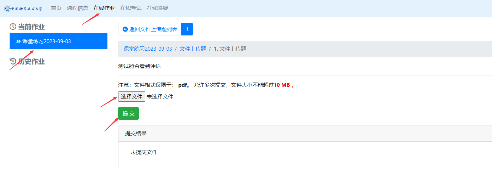
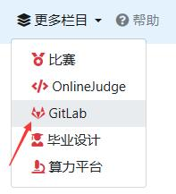

# 课程平台介绍

本课程使用希冀实验平台进行作业提交和在线评测，同时使用 git 和 gitlab 进行代码开发和项目管理。

## 希冀实验平台

网址：**[http://cscourse.ustc.edu.cn/](http://cscourse.ustc.edu.cn/)**

进入希冀平台后，使用学生入口填写学号（大写字母，如 PB20110001）和默认密码（与学号相同）登录。如果您已注册过希冀平台账号，请使用原密码登录。

在网页右上角选择“编译原理和技术”课程实验平台。

首次登录希冀平台时，请记得修改默认密码并完善个人信息。

在希冀平台，您可以查看最新公告、作业和截止时间。**请注意，所有作业和实验都需要在平台上提交和批改。**

## 作业及实验提交

在课程平台左上角选择当前作业，在线提交如下：

1. 请提交作业和实验报告的 PDF 文件，确保照片部分清晰可读。如果因图片清晰度问题而导致扣分，则不接受相关的申诉。
2. 提交作业不接受迟交或补交。
3. 实验提交在该平台进行，详细说明将在实验发布时提供。

作业和实验报告撰写推荐使用 Markdown，简单易学易上手。

Markdown 相关阅读材料：[https://markdown.com.cn/basic-syntax/](https://markdown.com.cn/basic-syntax/)

> Markdown 是一种轻量级标记语言，排版语法简洁，让人们更多地关注内容本身而非排版。它使用易读易写的纯文本格式编写文档，可与 HTML 混编，可导出 HTML、PDF 以及本身的 .md 格式的文件。因简洁、高效、易读、易写，Markdown 被大量使用，如 Github、Wikipedia、简书等。

## Git & Gitlab

本课程使用 Git 进行代码版本管理，结合 GitLab 进行远程代码托管。

> Git is a [free and open source](https://git-scm.com/about/free-and-open-source) distributed version control system designed to handle everything from small to very large projects with speed and efficiency.
>
> Git is [easy to learn](https://git-scm.com/doc) and has a [tiny footprint with lightning fast performance](https://git-scm.com/about/small-and-fast). It outclasses SCM tools like Subversion, CVS, Perforce, and ClearCase with features like [cheap local branching](https://git-scm.com/about/branching-and-merging), convenient [staging areas](https://git-scm.com/about/staging-area), and [multiple workflows](https://git-scm.com/about/distributed).

> **GitLab 是一个用于[仓库管理系统](https://www.zhihu.com/search?q=%E4%BB%93%E5%BA%93%E7%AE%A1%E7%90%86%E7%B3%BB%E7%BB%9F&search_source=Entity&hybrid_search_source=Entity&hybrid_search_extra=%7B%22sourceType%22%3A%22answer%22%2C%22sourceId%22%3A884336808%7D)的[开源项目](https://www.zhihu.com/search?q=%E5%BC%80%E6%BA%90%E9%A1%B9%E7%9B%AE&search_source=Entity&hybrid_search_source=Entity&hybrid_search_extra=%7B%22sourceType%22%3A%22answer%22%2C%22sourceId%22%3A884336808%7D)**，使用 Git 作为代码[管理工具](https://www.zhihu.com/search?q=%E7%AE%A1%E7%90%86%E5%B7%A5%E5%85%B7&search_source=Entity&hybrid_search_source=Entity&hybrid_search_extra=%7B%22sourceType%22%3A%22answer%22%2C%22sourceId%22%3A884336808%7D)，并在此基础上搭建起来的 Web 服务，可通过 Web 界面进行访问公开的或者私人项目。它拥有与**Github**类似的功能，能够浏览[源代码](https://www.zhihu.com/search?q=%E6%BA%90%E4%BB%A3%E7%A0%81&search_source=Entity&hybrid_search_source=Entity&hybrid_search_extra=%7B%22sourceType%22%3A%22answer%22%2C%22sourceId%22%3A884336808%7D)，管理缺陷和注释。

在本课程实验中，你将使用 git 进行版本管理，需要至少掌握以下指令：

- git init
- git add
- git commit
- git clone
- git merge
- git branch
- git pull
- git push

参考阅读材料：[https://www.liaoxuefeng.com/wiki/896043488029600](https://www.liaoxuefeng.com/wiki/896043488029600)

Gitlab 是一个代码管理平台。关于 gitlab，你至少需要掌握以下概念：

- ssh key
- project private and public
- watch, star and fork
- ……

参考阅读材料：[https://www.liaoxuefeng.com/wiki/896043488029600](https://www.tutorialspoint.com/gitlab/gitlab_create_project.htm)

要访问 GitLab，请点击实验平台右上角的导航栏。

若尚未设置电子邮箱账号，请进行注册。注册成功后 GitLab 用户名和密码和希冀平台相同。

**请注意，不要更改 GitLab 账户用户名，因用户名导致的错判漏判，一律不接受申诉。**

