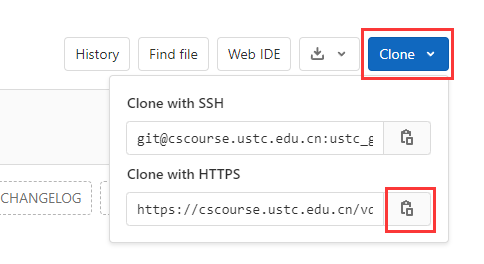

# Git 的使用

本课程使用 Git 作为代码管理工具，GitLab 作为代码管理仓库。为了后续实验的便捷进行，需要掌握 Git 的基本用法。

## Git 配置

在 Linux 环境中，我们已经通过 apt 安装了 Git。然而，还需要进行一些配置以确保每次代码提交都能正确标识提交者。在 Shell 中运行以下命令，并将 "Your Name" 和 "Your Email" 替换为你自己的信息：

```bash
git config --global user.name "Your Name"
git config --global user.email "Your Email"
```

这些配置信息会记录每次代码更新的提交者和联系方式，有助于代码的追踪。

## 创建你的仓库

我们将使用 GitLab 进行远程代码管理。虽然你没有权限在 GitLab 上创建仓库，但你可以通过 fork 的方式拥有一个属于自己的仓库。

1. 进入以下公开仓库链接：**[https://cscourse.ustc.edu.cn/vdir/Gitlab/compiler_staff/2023_warm_up_b](https://cscourse.ustc.edu.cn/vdir/Gitlab/compiler_staff/2023_warm_up_b)**
2. 点击右上角的 "Fork" 按钮。这个操作会创建一个与原仓库一模一样的新仓库，唯一的区别是，这个新仓库是你自己的。你可以在新仓库上执行任何你需要的操作。

   

3. 点击 "Fork" 后，页面将自动跳转到新的仓库页面，你将成为这个仓库的拥有者，这也会显示在仓库名称旁边。


现在，你已经成功拥有了自己的第一个仓库。接下来，我们可以开始对这个仓库进行修改。

## 进行一次提交

由于仓库目前在服务器上，我们首先得到仓库的 URL，并通过 git clone 将其下载到本地。

1. 得到仓库的 URL

   

2. 在 Ubuntu 环境中，利用得到的 URL，克隆仓库到本地

   ```bash
   # 使用 URL 进行 git clone XXX 为你的用户名
   git clone https://cscourse.ustc.edu.cn/vdir/Gitlab/XXX/2023_warm_up_b.git
   ```

3. 输入 GitLab 用户名和密码进行身份验证，验证完毕后就将服务器上的仓库克隆到了本地

   ```bash
   # 检查是否成功 clone
   $ cd 2023_warm_up_b
   $ ls
   warm_up.txt
   ```

此时，我们可以创建并提交第一个文件

3. 创建一个 readme.md 文件

   ```bash
   touch readme.md
   ```

4. 在 readme.md 中添加 hello world 信息

   ```bash
   $ echo "# Hello World" >> readme.md
   $ cat readme.md
   # Hello World
   ```

5. 将 readme.md 添加到 git 的暂存区

   ```bash
   # git add 指令可以将文件添加到 git 的暂存区
   # git 的暂存区是用于存放本次的所有修改
   $ git add readme.md

   # 我们可以通过 git status 查看 git 的暂存区
   $ git status
   On branch master
   Your branch is up to date with 'origin/master'.

   Changes to be committed:
     (use "git restore --staged <file>..." to unstage)
           new file:   readme.md
   ```

6. 提交本次修改并添加提交信息

   ```bash
   # 使用 git commit 提交本次修改到 Git 本地仓库
   # -m 后面的内容用于帮助记录本次提交的相关信息，要求每次提交最好都记录信息
   $ git commit -m 'add readme'
   [master bc20c0b] add readme
    1 file changed, 1 insertion(+)
    create mode 100644 readme.md

   # 我们可以通过 git log 查看历史提交记录
   $ git log
   commit bc20c0b170a829948439961745cf1a2dc7817e86 (HEAD -> master)
   Author: gpzlx1 <gpzlx1@mail.ustc.edu.cn>
   Date:   Wed Sep 6 19:01:15 2023 +0800

       add readme

   commit 6d08e6d4a1be64dea41798086b54cb0acc4377e2 (origin/master, origin/HEAD)
   Author: 123 <hej148@nenu.edu.cn>
   Date:   Tue Sep 5 22:39:37 2023 +0800

       copy b

   commit 1abfe16c1d28becaea62aa0971b1e7afd1f4672e
   Author: 123 <hej148@nenu.edu.cn>
   Date:   Tue Sep 5 22:02:53 2023 +0800

       欢迎加入编译原理
   ```

通过以上操作，我们完成了一次本地修改和提交。然而，请注意这些更改仅存储在本地，需要使用 "git push" 命令将它们上传到服务器，以实现本地和服务器的同步。

```bash
$ git push origin master  # 推送本地仓库的内容到 Git 远程仓库
Enumerating objects: 4, done.
Counting objects: 100% (4/4), done.
Delta compression using up to 8 threads
Compressing objects: 100% (2/2), done.
Writing objects: 100% (3/3), 290 bytes | 290.00 KiB/s, done.
Total 3 (delta 0), reused 0 (delta 0), pack-reused 0
To https://cscourse.ustc.edu.cn/vdir/Gitlab/ustc_gongping/2023_warm_up_b.git
   6d08e6d..bc20c0b  master -> master
```

现在，刷新 GitLab 页面，刚刚提交的内容已经显示在网页上。


## 上下游同步和冲突处理

通过 fork 操作，你已经拥有了一个自己的仓库，在此我们可以引入上下游的概念。假设通过 Fork 仓库 A 得到仓库 B，那么 A 就是 B 的上游。尽管 A 和 B 可能有大部分相同的内容，但对 A 和 B 的修改是彼此独立的。在这个课程实验中，我们将以类似的方式发布实验代码，助教维护上游仓库 A，而学生修改下游仓库 B。由于 A 和 B 的修改是相互独立的，接下来我们将介绍如何使 B 同步 A 的相关修改。

接下来，以**[https://cscourse.ustc.edu.cn/vdir/Gitlab/compiler_staff/2023_warm_up](https://cscourse.ustc.edu.cn/vdir/Gitlab/compiler_staff/2023_warm_up)** 作为上游仓库为例：

- 添加上游仓库
  ```bash
  # 可以通过 git remote add 添加上游仓库
  # 用 upstream 标识该上游仓库
  $ git remote add upstream https://cscourse.ustc.edu.cn/vdir/Gitlab/compiler_staff/2023_warm_up.git
  ```
- 抓取上游仓库

  ```bash
  # 使用以下命令从上游仓库获取最新代码
  $ git fetch upstream master
  remote: Enumerating objects: 5, done.
  remote: Counting objects: 100% (5/5), done.
  remote: Total 3 (delta 0), reused 0 (delta 0), pack-reused 0
  Unpacking objects: 100% (3/3), 258 bytes | 51.00 KiB/s, done.
  From https://cscourse.ustc.edu.cn/vdir/Gitlab/compiler_staff/2023_warm_up
   * branch            master     -> FETCH_HEAD
   * [new branch]      master     -> upstream/master
  hint: You have divergent branches and need to specify how to reconcile them.
  hint: You can do so by running one of the following commands sometime before
  hint: your next pull:
  hint:
  hint:   git config pull.rebase false  # merge (the default strategy)
  hint:   git config pull.rebase true   # rebase
  hint:   git config pull.ff only       # fast-forward only
  hint:
  hint: You can replace "git config" with "git config --global" to set a default
  hint: preference for all repositories. You can also pass --rebase, --no-rebase,
  hint: or --ff-only on the command line to override the configured default per
  hint: invocation.
  fatal: Need to specify how to reconcile divergent branches.

  # 此时所有的 upstream 的内容都在 upstream/master 分支上
  # 分支是 git 的一个重要概念，在本质上是一条独立的开发线。
  # 在处理新功能或 bug 修复时，您可以使用分支来将您的工作与其他团队成员的工作隔离开来。
  ```

- 合并分支并处理冲突

  ```bash
  # 此时我们的仓库中存在两条分支
  # master: 我们修改内容
  # upstream/mater: 上游的内存
  # 我们可以通过 merge 操作将 upstream/master 的内容合并到 master 中
  $ git merge upstream/master
  Auto-merging warm_up.txt
  CONFLICT (content): Merge conflict in warm_up.txt
  Automatic merge failed; fix conflicts and then commit the result.

  # 此时输出信息，告诉我们在 warm_up.txt 中存在冲突，这是由于 master 分支
  # 和upstream/master分支都对改文件相同位置进行了修改，此时需要我们手动处理冲突
  # 然后才能完成分支的合并和代码的同步

  # 我们先查看当前 warm_up.txt 的内容
  $ cat warm_up.txt
  <<<<<<< HEAD
  欢迎你同学加入编译原理课程学习！
  =======
  欢迎您加入编译原理课程学习！
  >>>>>>> upstream/master

  # 这里出现了 <<< ==== >>>>等标识符
  # <<< 和 ===之间的内容是当前这个分支的内容
  # === 和 >>>之间的内容是计划 merge 进来的分支的内容
  # 你现在可以根据自己的需要选择某一个分支的内容，又或者综合两个分支的内容进行修改
  # 比如本教程选择保留进来的内容，删除当前的内容
  # 那更改 warm_up.text 的内容为以下，并删除<<< ==== >>>>等标识符
  $ cat warm_up.txt
  欢迎您加入编译原理课程学习！

  # 此时，我们完成该文件的冲突处理，我们可以添加和提交本次修改，完成 merge 操作
  $ git add warm_up.txt
  $ git commit
  [master 126d5c9] Merge remote-tracking branch 'upstream/master'

  # 最后，将所有修改同步到远程服务器，方便助教进行批改
  $ git push origin master
  Enumerating objects: 10, done.
  Counting objects: 100% (10/10), done.
  Delta compression using up to 8 threads
  Compressing objects: 100% (3/3), done.
  Writing objects: 100% (6/6), 626 bytes | 626.00 KiB/s, done.
  Total 6 (delta 0), reused 0 (delta 0), pack-reused 0
  To https://cscourse.ustc.edu.cn/vdir/Gitlab/ustc_gongping/2023_warm_up_b.git
     bc20c0b..126d5c9  master -> master
  ```

## 扩展材料

**Git 教程** [https://www.liaoxuefeng.com/wiki/896043488029600](https://www.liaoxuefeng.com/wiki/896043488029600)

**Git 文档** [https://git-scm.com/book/zh/v2](https://git-scm.com/book/zh/v2)

## 实验任务

1. 根据上述操作，完成 readme.md 添加、上游仓库添加和冲突处理等操作。
2. 阅读扩展材料，回答以下问题，将答案添加到`answer.pdf`。
   1. 如何创建一个新的 git 分支？如何进行分支切换？如何删除一个分支？什么时候可以安全的删除一个分支？
   2. 如何撤销保存在暂存区的修改？如何撤销已经提交的修改？
   3. 如何从远程仓库抓取更新？
   4. 解释 git init 的作用？
   5. 解释 git fetch 和 git pull 的区别。
3. 将 [LLVM 等软件环境配置与测试](software.md) 中生成的 Text.ll 文件添加到仓库中，并上传到远程仓库中去。
