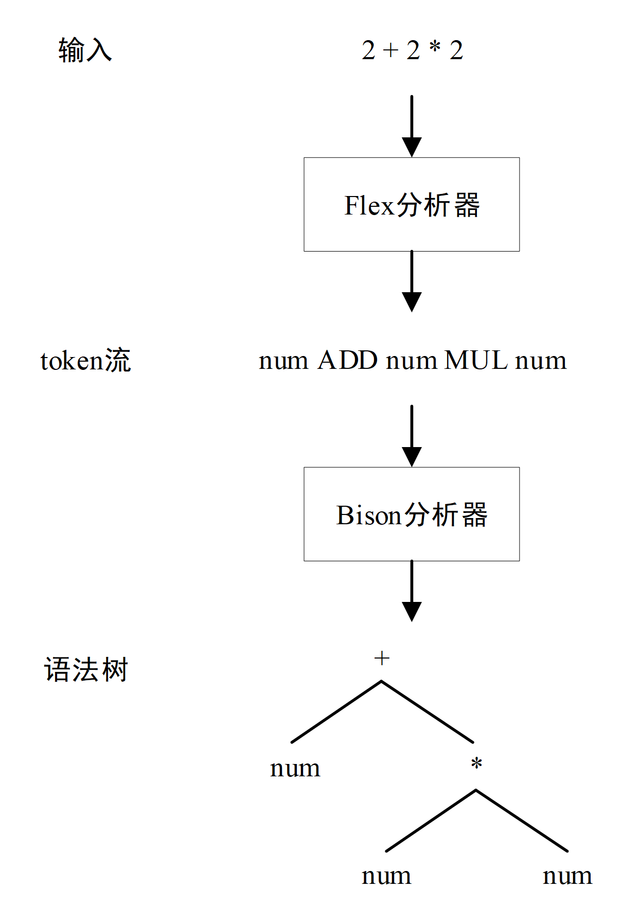

# Bison

## 简介

Bison是一款LALR文法解析器生成器，可转换为可编译的C代码，减轻手动设计解析器的工作。它重新实现了早期Unix上的Yacc工具，文件扩展名为.y（Yacc意为Yet Another Compiler Compiler）。

Flex和Bison是Linux下生成词法分析器和语法分析器的工具，用于处理结构化输入，协同工作解析复杂文件。Flex将文本文件拆分为有意义的词法记号（token），而Bison根据语法规则生成抽象语法树（AST），Bison在协同工作中担任主导角色，而Flex辅助生成yylex函数。

以计算器程序（该程序即为下文的[一个复杂的Bison程序](## 一个复杂的Bison程序)）为例，用户在界面输入`2 + 2 * 2`，Flex将输入识别为token流，其中2被识别为`number`，`+`被识别为`ADD`，`*`被识别为`MUL`。接下来，Bison负责根据语法规则将这些token组织成AST树，流程如下图所示：




## Bison程序结构

Bison 源程序的一般结构如下所示。Bison 源程序后缀一般为.y。

```shell
定义部分

语法规则部分

C代码部分
```


**定义部分**可以分为以下两个部分：

1. 包括C语言代码、头文件引用、宏定义、全局变量定义和函数声明等内容，位于`%{`和`%}`之间。 

2. 终结符和非终结符声明：用于定义语法中使用的终结符（也称为记号）和非终结符，常见声明包括`%token`、`%union`、`%start`、`%type`、`%left`、`%right`、`%nonassoc`等。

   * `%token` 定义终结符。定义形式：`%token TOKEN1 TOKEN2`。一行可定义多个终结符，空格分隔。一般约定终结符都是大写，非终结符的名字是小写。

   * `%type`定义非终结符。

   * `%left`、`%right`、`%nonassoc` 定义终结符的结合性和优先级关系。定义形式与`%token`类似。先定义的优先级低，最后定义的优先级最高，同时定义的优先级相同。`%left` 表示左结 合（如“+”、“-”、“*”、“/”）；`%right` 表示右结合（例如“=”）；`%nonassoc` 表示不可结合 （即它定义的终结符不能连续出现。例如“-”负号。如下定义中，优先级关系为：AA = BB < CC < DD；表示结合性为：AA、BB 左结合， DD 右结合，CC 不可结合。

     ```c
     %left AA BB
     %nonassoc CC
     %right DD
     ```

   * `%union` 定义了语法符号的语义值类型的集合。在 Bison 中，每个符号，包括记号和非终结符，都有一个不同数据类型的语义值，并且这些值通过 yylval 变量在移进和归约操作中传递。默认情况下，YYSTYPE（宏定义）为 yylval 的类型，通常为 int。但通过使用 %union，你可以重新定义符号的类型。使用 union 是因为不同节点可能需要不同类型的语义值，比如下面的定义，希望 ADDOP 的 值是 char 类型，而 NUMBER 应该是 double 类型。

     ```shell
     %token <num> NUMBER
     %token <op> ADDOP MULOP LPAREN RPAREN
     %union {
      char op;
      double num;
     }
     
     # 注意：一旦%union被定义，需要指定 Bison 每种符号使用的值类型，值类型通过放在尖括号中的 union 类型对应的成员名称确定，如%token <num>。
     ```

3. 使用`%start`指定文法的开始符号，表示最终需要规约成的符号，例如 `%start program`。如果不使用`%start`定义文法开始符 号，则默认在第二部分规则段中定义的第一条生产式规则的左部非终结符为开始符号。


语法规则部分：

* 语法规则部分由语法规和动作组成。语法规则基本按照巴科斯范式（BNF）描述。规则中目标或非终端符放在左边，后跟一个冒号：然后是 产生式的右边，之后是对应的动作（用{}包含）。**Bison的语法树是按自下而上的归约方式进行构建的**。如下所示：

  ```c
  %%
   program: program expr '\n' { printf("%d\n", $2); }
   ;
   expr: expr '+' expr { $$ = $1 + $3; }
   | expr '-' expr { $$ = $1 - $3}
   ;
  %%
  /* 动作中“$1”表示右边的第一个标记的值，“$2”表示右边的第二个标记的值，依
  次类推。“$$”表示归约后的值。以“expr: expr '+' expr { $$ = $1 + $3; }”，说明“$$”表示从左
  向右第一个 expr，即规约的结果，“$1”表示从左向右第二个 expr，“$2”表示“+”加号，“$3”
  表示从左向右第三个 expr。“|”符号表示其他的规约规则。 */
  ```


C代码部分：

* C 代码部分为 C 代码，会被原样复制到 c 文件中，这里一般自定义一些函数。主要包括调用 Bison 的语法分析程序 yyparse()。其中yyparse函数由Bison根据语法规则自动生成，用于语法分析。

## 一个简单Bison程序

我们首先展示一个简单的Bison程序`bison_demo.y`，帮助你理解Bison，请仔细阅读文件内容。该程序没有联动Flex，直接由用户提供`yylex`函数进行token分析，`yylex`函数将在Bison生产的函数`yyparse`中被调用。

```c
/* file name : bison_demo.y */
%{
#include <stdio.h>
/* 定义部分 */
/* 这部分代码会被原样拷贝到生成的 .c 文件的开头 */
int yylex(void);
void yyerror(const char *s);
%}

/* 定义部分 */
/* 对语法的终结符和非终结符进行声明 */
%start reimu
%token REIMU
    
/* 从这里开始，下面是解析规则 */    
%%
reimu : marisa { /* 这里写与该规则对应的处理代码 */ puts("rule1"); }
      | REIMU  { /* 这里写与该规则对应的处理代码 */ puts("rule2"); }
      ; /* 规则最后不要忘了用分号结束哦～ */
      
 /* 这种写法表示 ε —— 空输入 */
marisa : { puts("Hello!"); }
%%


/* 以下是C代码部分 */
/* 在这个Bison程序中，我们没有联动Flex，所以手写一个yylex函数 */
int yylex(void)
{
    int c = getchar(); // 从 stdin 获取下一个字符 
    switch (c) {
    case EOF: return YYEOF;
    case 'R': return REIMU;
    default:  return YYUNDEF;     // 报告 token 未定义，迫使 bison 报错。
    // 由于 bison 不同版本有不同的定义。如果这里 YYUNDEF 未定义，请尝试 YYUNDEFTOK 或使用一个随意的整数。
    }
}

void yyerror(const char *s)
{
    fprintf(stderr, "%s\n", s);
}

int main(void)
{
    yyparse(); // 启动解析
    return 0;
}
```


编译和运行：

```shell
$ bison bison_demo.y

# 查看生产的c程序
$ ls bison_demo.tab.c
bison_demo.tab.c

$ gcc bison_demo.tab.c
$ ./a.out
R # <-- 不要回车，在这里按 Ctrl-D
rule2

$ ./a.out
# <-- 不要回车，在这里按 Ctrl-D
Hello!
rule1

$ ./a.out
blablabla # <-- 不要回车，在这里按 Ctrl-D
Hello!
rule1
syntax error <-- 发现了错误
```


## 一个复杂的Bison程序

我们接下来展示一个复杂的Bison程序，该程序同时使用Flex和Bison，使用Flex生产的yylex函数进行字符串分析，Bison生成的`yyparse`进行语法树构建。共涉及2个文件，`calc.y`和`calc.l`。其功能是实现一个数值计算器。

```c
/* calc.y */
%{
#include <stdio.h>
    int yylex(void);
    void yyerror(const char *s);
%}

%token RET
%token <num> NUMBER
%token <op> ADDOP MULOP LPAREN RPAREN
%type <num> top line expr term factor

%start top

%union {
    char   op;
    double num;
}

%%

top
: top line {}
| {}

line
: expr RET
{
    printf(" = %f\n", $1);
}

expr 
: term
{
    $$ = $1;
}
| expr ADDOP term
{
    switch ($2) {
    case '+': $$ = $1 + $3; break;
    case '-': $$ = $1 - $3; break;
    }
}

term
: factor
{
    $$ = $1;
}
| term MULOP factor
{
    switch ($2) {
    case '*': $$ = $1 * $3; break;
    case '/': $$ = $1 / $3; break; // 这里会出什么问题？
    }
}

factor
: LPAREN expr RPAREN
{
    $$ = $2;
}
| NUMBER
{
    $$ = $1;
}

%%

void yyerror(const char *s)
{
    fprintf(stderr, "%s\n", s);
}

int main()
{
    yyparse();
    return 0;
}
```

```c
/* calc.l */
%option noyywrap

%{
/* 引入 calc.y 定义的 token */
/* calc.tab.h 文件由 Bison生成 */
/* 当我们在.y 文件中使用 %token 声明一个 token 时，这个 token 就会导出到 .h 中，
   可以在 C 代码中直接使用，供 Flex 使用。 就如 .l 文件中的\( { return LPAREN; }，
   其中LPAREN定义来自 calc.tab.h，由对应的 .y 文件生成 */
#include "calc.tab.h"
%}


/* 规则部分 yylval 同样来自 calc.tab.h 文件，其类型为 YYSTYPE，用于token的相关属性，比如NUMBER对应的实际数值 */
/* 在这个例子中，YYSTYPE定义如下

typedef union YYSTYPE {
  char op;
  double num;
} YYSTYPE;

其同样由 .y 文件根据%union生成，在文件中我们的%union定义如下

%union {
    char   op;
    double num;
}
*/

%%
\( { return LPAREN; }
\) { return RPAREN; }
"+"|"-" { yylval.op = yytext[0]; return ADDOP; }
"*"|"/" { yylval.op = yytext[0]; return MULOP; }
[0-9]+|[0-9]+\.[0-9]*|[0-9]*\.[0-9]+ { yylval.num = atof(yytext); return NUMBER; }
" "|\t {  }
\r\n|\n|\r { return RET; }
%%
```

使用如下命令构建并测试程序：

```shell
# 生成 calc.tab.c 和 calc.tab.h。如果不给出 -d 参数，则不会生成 .h 文件。
$ bison -d calc.y 
# 生成lex.yy.c
$ flex calc.l

$ ls calc.tab.c calc.tab.h lex.yy.c
calc.tab.c  calc.tab.h  lex.yy.c

# 编译
$ gcc lex.yy.c calc.tab.c -o calc
$ ./calc
1+1
 = 2.000000
2*(1+1)
 = 4.000000
2*1+1
 = 3.000000
```

其大致工作流程如下：


### 思考题

* 上述计算器例子的文法中存在左递归，为什么 `bison` 可以处理？
* 能否修改计算器例子的文法，使得它支持除数0规避功能？