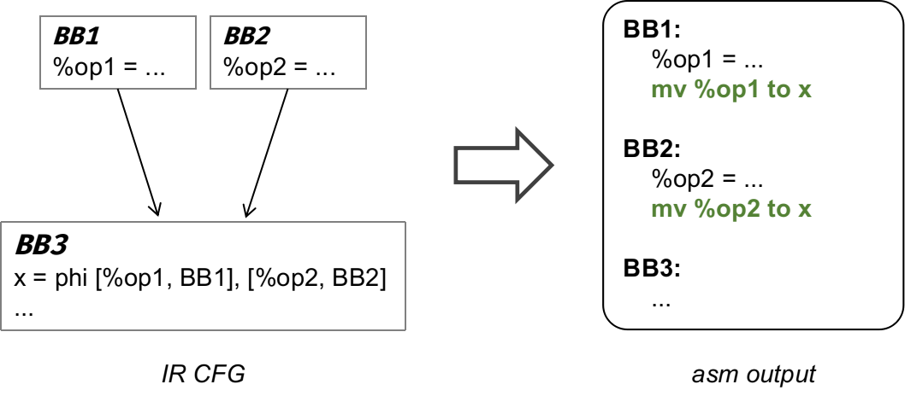
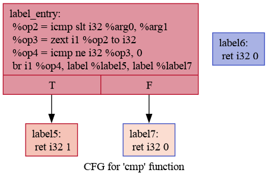

# Lab4 Mem2Reg

经过前序实验，同学们已经基本完成了一个贯穿从前端到后端的简单编译器，祝贺大家！然而，该编译器生成的代码只能保证语义正确、能在目标机器上运行。接下来，我们将让大家体验如何通过增加优化 pass 让生成的代码快起来。正如课上所讲，优化的方法有很多，由于时间关系，我们不能一一尝试。因此，我们为大家准备了 Mem2Reg 优化实验，在该实验中，同学们将实现这一优化 pass。完成代码后，同学们可以在测试样例中，看到优化前后的性能差距。

!!! warning "Deadline"

    **2023 年 12 月 18 日 23:59**

## 同步实验仓库

在进行实验之前，首先拉取[实验仓库](https://cscourse.ustc.edu.cn/vdir/Gitlab/compiler_staff/2023ustc-jianmu-compiler)的最新代码，具体步骤可以参考 [Lab2 中的指导](../lab2/index.md#实验要求)。

本次实验仓库更新的内容如下，每个阶段的文件将在对应文档详细说明：

```
.
├── ...
├── include
│   ├── ...
│   └── passes
|       ├── PassManager.hpp		# PassManager：管理 pass 的运行
│       ├── FuncInfo.hpp		# pass 1：纯函数分析
│       ├── DeadCode.hpp		# pass 2：死代码删除
│       ├── Dominators.hpp		# pass 3：支配树分析（需要阅读，根据需要修改）
│       └── Mem2Reg.hpp			# pass 4：Mem2Reg 分析（需要阅读，根据需要修改）
├── src
│   ├── ...
│   └── passes
│       ├── ...
│       ├── Dominators.cpp	<-- 支配树分析实现，需要补全
│       └── Mem2Reg.cpp		<-- Mem2Reg 实现，需要补全
└── tests
    ├── ...
    └── 4-mem2reg				# Lab4 的本地测试
```

## 实验内容

### 阅读与学习

- 回顾课上关于支配树的介绍，并阅读 [Mem2Reg 介绍](./Mem2Reg介绍.pdf)，了解 Mem2Reg 的基本原理

  > 支配树的相关算法伪代码可以参考如下文章：[Dom.pdf](Dom.pdf)。注意助教在其中的的标柱。

- 阅读 PassManager、FuncInfo 和 DeadCode 的实现，了解如何编写 pass

### 代码撰写

1. 补全 `src/passes/Dominators.cpp` 文件，使编译器能够进行正确的支配树分析
2. 补全 `src/passes/Mem2Reg.cpp` 文件，使编译器能够正确执行 Mem2Reg
3. 将 phi 指令转化为 copy statement，令后端可以正确处理 phi 指令

!!! info "关于 copy statement"

    **什么是 copy statement？**

    在进行后端翻译时，我们根据 phi 节点的语义，将其转化为前驱块的拷贝操作，如下图所示。

    

    **这样做正确吗？**

    这种 naive 的方案并不完全正确，在个别极端情况下，它会带来 Lost Of Copy 等问题，但是在本次实验中不会出现，所以你可以放心采用这个方案。

## 本地测试

### 测试脚本

`tests/4-mem2reg` 目录的结构如下：

```
.
├── functional-cases	# 功能测试样例
├── performance-cases	# 性能测试样例
├── cleanup.sh
├── eval_lab4.sh		# lab4 评测脚本
└── test_perf.sh		# 性能比较脚本
```

其中本地测评脚本 `eval_lab4.sh` 与 Lab3 一致，使用方法可以回顾 [Lab3 测试](../lab3/guidance.md#测试)，要求通过的测例目录：

- `tests/testcases_general`
- `tests/4-mem2reg/functional-cases`

此外，为了让你能够体会 Mem2Reg 的效果，我们还提供了 3 个性能测试样例，在 `performance-cases` 中。你可以使用脚本 `test_perf.sh` 来进行性能比较，使用示例如下所示。

??? info "`test_perf.sh` 使用示例"

    ```shell
    $ ./test_perf.sh
    [info] Start testing, using testcase dir: ./performance-cases
    ==========./performance-cases/const-prop.cminus==========
    ==========mem2reg off

    real	0m13.052s
    user	0m13.014s
    sys	0m0.009s
    ==========mem2reg on

    real	0m11.929s
    user	0m11.905s
    sys	0m0.007s
    ==========./performance-cases/loop.cminus==========
    ==========mem2reg off

    real	0m7.129s
    user	0m7.117s
    sys	0m0.007s
    ==========mem2reg on

    real	0m5.112s
    user	0m5.110s
    sys	0m0.000s
    ==========./performance-cases/transpose.cminus==========
    ==========mem2reg off

    real	0m15.186s
    user	0m15.171s
    sys	0m0.003s
    ==========mem2reg on

    real	0m10.473s
    user	0m10.440s
    sys	0m0.007s
    ```

### IR CFG

在实现支配树时，为了方便同学们测试支配树的正确性，本节将向你介绍两个工具：[opt](https://llvm.org/docs/CommandGuide/opt.html) 和 [dot](https://manpages.ubuntu.com/manpages/trusty/man1/dot.1.html)。opt 和 dot 配合使用可以将 IR 文件转换为 CFG 图片，将基本块之间的关系可视化，利用可视化的 CFG，可以判断生成的支配树是否正确。

在你的机器上，opt 已经随 llvm 一起安装，使用以下命令安装 dot：

```
$ sudo apt install graphviz
```

以如下 `test.ll` 文件为例：

??? info "test.ll"

    ```c
    define i32 @cmp(i32 %arg0, i32 %arg1) {
    label_entry:
      %op2 = icmp slt i32 %arg0, %arg1
      %op3 = zext i1 %op2 to i32
      %op4 = icmp ne i32 %op3, 0
      br i1 %op4, label %label5, label %label7
    label5:                                                ; preds = %label_entry
      ret i32 1
    label6:
      ret i32 0
    label7:                                                ; preds = %label_entry
      ret i32 0
    }

    define i32 @main() {
    label_entry:
      %op0 = call i32 @cmp(i32 1, i32 2)
      ret i32 %op0
    }
    ```

在 `test.ll` 的同级目录下：

```shell
$ opt -passes=dot-cfg test.ll >/dev/null
Writing '.cmp.dot'...
Writing '.main.dot'...
```

可以看到 opt 输出了两个 dot 文件，分别与 ll 中的两个函数对应。然后我们使用 dot 工具将其转化为图片：

```shel
$ dot .main.dot -Tpng > main.png
$ dot .cmp.dot -Tpng > cmp.png
```

比如得到的 `cmp.png` 如下：



## 编译与运行

按照如下示例进行项目编译：

```shell
$ cd 2023ustc-jianmu-compiler
$ mkdir build
$ cd build
# 使用 cmake 生成 makefile 等文件
$ cmake ..
# 使用 make 进行编译，指定 install 以正确测试
$ sudo make install
```

现在你可以 `-mem2reg` 使用来指定开启 Mem2Reg 优化：

- 将 `test.cminus` 编译到 IR：`cminusfc -emit-llvm -mem2reg test.cminus`
- 将 `test.cminus` 编译到汇编：`cminusfc -S -mem2reg test.cminus`

## 提交方式

- 在希冀平台提交实验仓库的 URL

  > 在提交之前，请确保你 fork 得到的远程仓库与本地同步：`git push origin master`

- 在希冀平台提交实验报告（实现方法、正确性验证、性能验证等）
